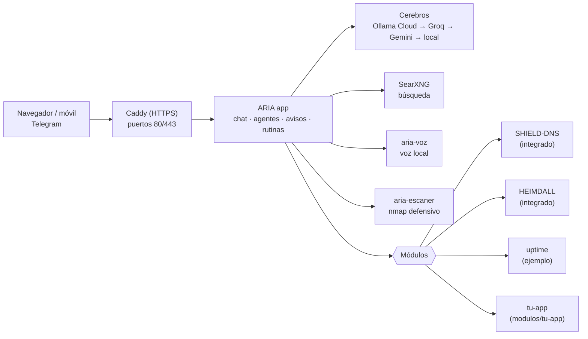

# ARIA

**ARIA es un asistente de inteligencia artificial autoalojado que gestiona tus aplicaciones de casa.** Se instala con un comando en una Raspberry Pi o en un PC con Linux, se abre desde el navegador o el móvil y entiende español: le hablas o le escribes y ella consulta, enciende, pausa o te avisa.

ARIA se amplía con **módulos**: cada aplicación que añades aparece en su página de Inicio, gana herramientas en el chat y puede mandarte avisos. Trae dos aplicaciones integradas como ejemplo, [SHIELD-DNS](https://github.com/BertMarti/SHIELD-DNS) (bloqueador de anuncios) y [HEIMDALL](https://github.com/BertMarti/HEIMDALL) (VPN), pero puedes añadir todas las que quieras.

- **Gratis.** Usa capas gratuitas de IA en la nube (Ollama Cloud, Groq, Gemini) y, si fallan, un modelo local.
- **Tuyo.** Corre en tu máquina, con tus usuarios y tus datos en una carpeta `data/`.
- **Para toda la casa.** Varios usuarios con roles, app instalable en el móvil, Telegram y notificaciones.

## Índice

- [Qué puede hacer](#qué-puede-hacer)
- [Cómo está hecha](#cómo-está-hecha)
- [Requisitos](#requisitos)
- [Inicio rápido (5 minutos)](#inicio-rápido-5-minutos)
- [Guías](#guías)
- [Configuración](#configuración)
- [Añade tus propias aplicaciones (módulos)](#añade-tus-propias-aplicaciones-módulos)
- [Cerebros: de dónde salen las respuestas](#cerebros-de-dónde-salen-las-respuestas)
- [Seguridad y privacidad](#seguridad-y-privacidad)
- [Contenedores y puertos](#contenedores-y-puertos)
- [Para desarrolladores](#para-desarrolladores)
- [Hoja de ruta](#hoja-de-ruta)
- [Licencia](#licencia)

## Qué puede hacer

### Asistente y chat
- Chat con conversaciones guardadas, respuestas en directo, botón Detener, copiar y Markdown.
- **Agentes especializados**: ARIA (general), `@finanzas`, `@redes` y `@seguridad`. ARIA elige el adecuado sola o lo eliges tú.
- **Búsqueda en internet y noticias** con un metabuscador propio (SearXNG), citando las fuentes.
- **Resumir enlaces** que pegas o compartes desde el móvil.
- **Visión**: mándale una foto y pregúntale por ella; si es un ticket, te propone apuntar el gasto.

### Voz
- Micrófono (pulsar para hablar), botón **Leer** en cada respuesta y modo **manos libres**: dices «Aria» y tu pregunta.
- Voz natural en la nube con respaldo local en tu máquina; transcripción en la nube con respaldo local.

### Memoria y automatización
- **Memoria**: recuerda datos tuyos («recuerda que…») y escribe un **diario** de cada día.
- **Resumen de buenos días** en Inicio, en el chat y, si quieres, por Telegram o notificación.
- **Recordatorios** en lenguaje natural («recuérdame mañana a las 9…») y **rutinas** programadas («cada mañana a las 8, dime el tiempo y tres titulares»).

### Avisos y canales
- Campana de avisos en la web, **bot de Telegram** propio y **notificaciones push** en el móvil o el navegador.
- Vigila la casa sola: servicios caídos, dispositivos desconocidos, temperatura, disco, copias atrasadas…

### Tu casa y tu red
- **Finanzas personales**: movimientos, categorías, presupuestos e importación del CSV del banco.
- **Inventario de red**: dispositivos de la LAN, latencia, test de velocidad e historial.
- **Seguridad**: escaneo defensivo de puertos de tu red y búsqueda de vulnerabilidades conocidas.
- **Control parental** por dispositivo (pausar internet, bloquear TikTok, YouTube…, horarios), mediante SHIELD-DNS.

### Aplicaciones (módulos)
- **SHIELD-DNS**: estadísticas, pausar y reanudar el bloqueo de anuncios.
- **HEIMDALL**: ver, crear, activar y desactivar dispositivos de la VPN con su código QR.
- **Uptime web** (módulo de ejemplo): «¿responde example.org?» y avisos si una web se cae.
- **Las tuyas**: un mosaico en Inicio, herramientas en el chat, avisos y endpoints propios. Ver [docs/MODULOS.md](docs/MODULOS.md).
- Spotify y Netflix existen en el código pero están **aparcados** (desactivados por defecto, `ARIA_SPOTIFY=0` / `ARIA_NETFLIX=0`).

### Acceso y usuarios
- HTTPS automático en tu red (`https://aria.local`, la IP o `https://aria.lan`).
- Opcional: tu dominio con **Cloudflare Tunnel + Access**, sin abrir puertos y con inicio de sesión único.
- Varios usuarios con rol **administrador** o **usuario**; permisos comprobados en el servidor.
- Paleta de órdenes **Ctrl+K**, app instalable (PWA) y menú **Compartir** de Android.

> No hay capturas de pantalla en el repositorio todavía.

## Cómo está hecha

ARIA es un **núcleo** (la app web, el chat y los cerebros) y un **cargador de módulos**. Cada aplicación de tu casa se conecta como un módulo: las integradas (SHIELD-DNS y HEIMDALL) vienen de serie y las tuyas se añaden como carpetas en `modulos/`.



Si tu visor no muestra el diagrama, este es el mismo esquema en texto:

```
 Navegador / móvil / Telegram
              │
        Caddy (HTTPS 80/443)
              │
          ARIA (núcleo) ───── Cerebros: Ollama Cloud → Groq → Gemini → local (Ollama)
          │   │   │  └────── SearXNG (búsqueda) · aria-voz (voz) · aria-escaner (red)
          │   │   │
   ┌──────┴───┴───┴──────────────┐
   │          Módulos            │
   ├─ SHIELD-DNS  (integrado)    │  bloqueador de anuncios (Pi-hole)
   ├─ HEIMDALL    (integrado)    │  VPN WireGuard (wg-easy)
   ├─ uptime      (ejemplo)      │  ¿responde esta web?
   └─ tu-app      (modulos/…)    │  lo que tú quieras
```

## Requisitos

| | Mínimo | Recomendado |
|---|---|---|
| Máquina | Raspberry Pi 4/5 o PC/mini-PC con Linux (arm64 o amd64) | Raspberry Pi 5 o mini-PC |
| RAM | 4 GB (usando sobre todo los cerebros en la nube y un modelo local pequeño) | 8 GB o más |
| Disco | 16 GB libres | 32 GB libres, mejor en SSD |
| Sistema | Raspberry Pi OS 64 bits, Debian o Ubuntu | Raspberry Pi OS 64 bits (Bookworm) |
| Software | Docker con `docker compose` v2 (el instalador ofrece instalarlo) | — |
| Red | Puertos 80 y 443 libres en la máquina | IP fija para la máquina (reserva DHCP en el router) |

- Las imágenes de Docker ocupan unos 10 GB (la de Ollama es la mayor) y el modelo local por defecto, unos 2 GB.
- **Windows**: ARIA no está probada en Windows. Con WSL2 la parte web podría funcionar, pero el escáner de red, SHIELD-DNS (puerto 53) y HEIMDALL (WireGuard) necesitan ver tu red de verdad, y eso en WSL2/Docker Desktop no está garantizado. Para algo fiable usa una Raspberry Pi o un PC con Linux.

## Inicio rápido (5 minutos)

1. **Clona el repositorio** en `~/homelab` (los scripts de copias y de Cloudflare esperan esa carpeta):
   ```bash
   mkdir -p ~/homelab && cd ~/homelab
   git clone https://github.com/BertMarti/ARIA.git && cd ARIA
   ```
2. **Instala**:
   ```bash
   ./install.sh
   ```
   Si no tienes Docker, te ofrece instalarlo; después cierra sesión, vuelve a entrar y repite `./install.sh`.
3. **Entra** en `https://aria.local` (o `https://192.168.1.50`, con la IP de tu máquina). El navegador avisará del certificado: es lo esperado la primera vez.
4. **Inicia sesión** con el usuario `admin` y la contraseña que muestra el instalador (también está en `ARIA_PASSWORD` dentro del archivo `.env`).
5. **Opcional, pero recomendado**: añade una clave gratuita de Groq o Gemini (o conecta Ollama Cloud) para respuestas rápidas. Ver [Claves gratuitas](docs/INSTALACION.md#6-claves-gratuitas-de-ia-opcional).

¿Quieres también el bloqueador de anuncios y la VPN? Instala las tres aplicaciones de una vez:

```bash
curl -fsSL https://raw.githubusercontent.com/BertMarti/ARIA/main/instalar-todo.sh | bash
```

## Guías

| Guía | Para qué |
|---|---|
| [Instalación paso a paso](docs/INSTALACION.md) | Hardware, Docker, primer acceso, claves gratuitas, certificado, dominio propio, router, Telegram, copias, actualizar y problemas frecuentes |
| [Guía de uso](docs/USO.md) | Cada sección de la web, frases de ejemplo, agentes, voz, memoria, rutinas, Telegram, control parental, usuarios |
| [Módulos](docs/MODULOS.md) | Conectar tus propias aplicaciones a ARIA (para desarrolladores) |
| [Hoja de ruta](docs/PLAN.md) | Ideas de lo que puede venir |

## Configuración

Toda la configuración está en el archivo `.env` (lo crea `install.sh` a partir de [`.env.example`](.env.example)). Tras editarlo, aplica los cambios con:

```bash
docker compose up -d
```

Variables principales (la lista completa y comentada está en `.env.example`):

| Área | Variable | Por defecto | Para qué |
|---|---|---|---|
| Acceso | `ARIA_USER` | `admin` | Administrador inicial |
| | `ARIA_PASSWORD` | aleatoria (la genera `install.sh`) | Su contraseña |
| | `ARIA_SECRET` | aleatorio | Firma de las sesiones |
| Red | `ARIA_LAN_IP` | la detecta `install.sh` | IP de la máquina en tu red |
| | `ARIA_HOSTS` | IP, `<nombre>.local`, `localhost`, `aria.local`, `aria.lan` | Nombres con los que puedes entrar (y para los que se emite certificado) |
| Cerebros | `ARIA_CEREBROS` | `ollama_cloud,groq,gemini,local` | Orden de la cadena de IA |
| | `GROQ_API_KEY` | vacía | Clave gratuita de Groq (chat, voz y visión) |
| | `GEMINI_API_KEY` | vacía | Clave gratuita de Gemini (chat, voz y visión) |
| | `ARIA_MODELO_OLLAMA_CLOUD` | `gpt-oss:120b-cloud` | Modelo de Ollama Cloud |
| | `ARIA_MODELO_GROQ` | `openai/gpt-oss-120b` | Modelo de Groq |
| | `ARIA_MODELO_GEMINI` | `gemini-3.1-flash-lite` | Modelo de Gemini |
| | `ARIA_NOMBRE_USUARIO` | vacío | Cómo te llama ARIA (vacío = tu nombre de usuario) |
| Modelo local | `ARIA_MODEL` | `llama3.2:3b` | Modelo de respaldo en tu máquina |
| | `OLLAMA_MEM_LIMIT` | `5g` | Memoria máxima de Ollama |
| | `ARIA_NUM_CTX` | `4096` | Contexto del modelo local (menos = menos RAM) |
| | `OLLAMA_KEEP_ALIVE` | `5m` | Cuánto se queda cargado en RAM |
| General | `ARIA_TZ` | `Europe/Madrid` | Zona horaria |
| | `ARIA_CIUDAD` | vacía | Ciudad para el tiempo (p. ej. `Madrid`); vacía = sin tiempo |
| Búsqueda | `SEARXNG_SECRET` | aleatorio | Clave interna del buscador |
| Integraciones | `SHIELD_URL` | vacía = `http://<ARIA_LAN_IP>:8080` (revisa que lleve tu IP) | Dirección de SHIELD-DNS |
| | `SHIELD_PASSWORD` | se copia de `../SHIELD-DNS/.env` | Contraseña de Pi-hole |
| | `VPN_URL` | vacía = `https://<ARIA_LAN_IP>:51843` (revisa que lleve tu IP) | Dirección de HEIMDALL |
| | `VPN_USER`, `VPN_PASSWORD` | se copian de `../HEIMDALL/.env` | Usuario y contraseña de wg-easy |
| Red y seguridad | `ARIA_RED_PERMITIDA` | una red /24 de ejemplo: **pon la tuya**, p. ej. `192.168.1.0/24` | Única red que ARIA puede escanear |
| | `ARIA_ROUTER_IP` | **pon la tuya**, p. ej. `192.168.1.1` | IP del router (nunca se pausa) |
| Control parental | `ARIA_CONTROL` | `1` | `0` lo desactiva |
| | `ARIA_CONTROL_PROTEGIDOS` | vacía | IP extra que nunca se pueden pausar |
| Avisos | `ARIA_URL_PUBLICA` | `https://aria.tu-dominio.com` | Tu dirección pública; **déjala vacía si no usas dominio** |
| | `TELEGRAM_BOT_TOKEN` | vacío | Token del bot (vacío = bot apagado) |
| | `VAPID_PUBLIC_KEY`, `VAPID_PRIVATE_KEY` | las genera `install.sh` | Notificaciones push |
| SSO (opcional) | `ARIA_CF_ACCESS_TEAM`, `ARIA_CF_ACCESS_AUD` | vacías | Inicio de sesión con Cloudflare Access |
| | `ARIA_ADMIN_EMAILS` | vacía | Emails que siempre son administradores |
| Módulos | `ARIA_MODULOS` | vacía (= todos) | Qué módulos se cargan (`-` = ninguno) |
| | `UPTIME_URLS` | vacía | Webs que vigila el módulo `uptime` |
| Aparcados | `ARIA_SPOTIFY`, `ARIA_NETFLIX` | `0` | Reactivan Spotify / Netflix |

Algunos ajustes se cambian también desde la web y entonces **la web manda** sobre `.env`: el orden de los cerebros (Ajustes → Cerebros, guardado en `data/cerebros.json`), el modelo local activo (`data/model.txt`) y la contraseña (si la cambias en Ajustes).

## Añade tus propias aplicaciones (módulos)

Un módulo es una carpeta en `modulos/`. El más sencillo solo necesita un `modulo.json` y ya pone un mosaico en Inicio con un punto verde o rojo según si tu aplicación responde:

```bash
cp -r modulos/_plantilla modulos/recetas
rm modulos/recetas/modulo.py modulos/recetas/compose.ejemplo.yml
```

`modulos/recetas/modulo.json`:

```json
{
  "id": "recetas",
  "nombre": "Recetas",
  "version": "1.0.0",
  "icono": "casa",
  "url": "http://{host}:8099/",
  "salud": {"tipo": "http", "host": "host.docker.internal", "puerto": 8099, "ruta": "/"},
  "roles": ["admin", "usuario"]
}
```

```bash
docker compose restart app
```

Con un `modulo.py` puedes añadir además herramientas al chat («¿qué receta toca hoy?»), avisos periódicos y endpoints propios. Todo está explicado, con la referencia del SDK, en **[docs/MODULOS.md](docs/MODULOS.md)**.

> Un módulo con `modulo.py` es código que se ejecuta dentro de ARIA. Instala solo módulos que hayas leído o de fuentes de confianza.

## Cerebros: de dónde salen las respuestas

ARIA prueba una **cadena de cerebros gratuitos** en orden. Si uno falla (límite gratuito agotado, clave rechazada, sin conexión o más de 30 s sin responder), pasa al siguiente sin que lo notes. Cada respuesta lleva una insignia con el cerebro que la dio.

| # | Cerebro | Clave | Notas |
|---|---|---|---|
| 1 | Ollama Cloud | tu cuenta de Ollama (`docker exec -it aria-ollama ollama signin`) | Plan gratuito con límites |
| 2 | Groq | `GROQ_API_KEY` | Gratis; también transcribe la voz |
| 3 | Google Gemini | `GEMINI_API_KEY` | Gratis; también la voz de ARIA y la visión |
| 4 | Local (Ollama) | ninguna | Funciona sin internet, pero es mucho más lento |

Sin ninguna clave, ARIA funciona solo con el modelo local. Orden y activación: **Ajustes → Cerebros** (con botón **Probar**). El cerebro local no se puede desactivar: es el último recurso.

## Seguridad y privacidad

- **Lo que sale de casa.** Con el cerebro local no sale nada. Con Ollama Cloud, Groq o Gemini, tus mensajes, parte de tu memoria y los resultados de las herramientas (estado de la máquina, anuncios bloqueados, nombres de dispositivos…) se envían a esas empresas. En el plan gratuito de Google, Google puede usarlos para mejorar sus productos. Si no quieres, desactiva esos cerebros en Ajustes → Cerebros.
- **Voz e imágenes.** El audio y las fotos se procesan en memoria y **no se guardan nunca**; solo queda el texto. Al hablar, el audio va a Groq (o se transcribe en tu máquina si no hay clave). Las fotos van a Gemini o Groq, sin metadatos (GPS, cámara…).
- **Acceso.** HTTPS siempre, contraseñas cifradas (scrypt), 5 intentos fallidos bloquean la IP 5 minutos, protección CSRF y permisos por rol comprobados en el servidor.
- **Secretos.** `.env` y `data/` no se suben a git. Las claves de las IA nunca se muestran en la web. Las claves privadas de WireGuard solo llegan al navegador cuando descargas un `.conf`.
- **Ojo:** los botones «Copiar contraseña» de Inicio dan la contraseña de los paneles de SHIELD-DNS y HEIMDALL a los administradores. Protege bien tu contraseña de ARIA.
- **Escaneo defensivo.** El agente Seguridad solo escanea la red de `ARIA_RED_PERMITIDA`, nunca ataca ni prueba contraseñas.
- **Módulos.** Son código con los mismos permisos que ARIA: instala solo los de confianza.
- **Copias.** Las copias contienen secretos: guárdalas fuera de la máquina y cifradas (ver [copias diarias](docs/INSTALACION.md#13-copias-de-seguridad-diarias-y-cifradas)).

## Contenedores y puertos

| Contenedor | Para qué | Puertos en tu máquina |
|---|---|---|
| `aria-caddy` | HTTPS y proxy | 80 (redirige a 443), 443 |
| `aria-app` | La aplicación | ninguno |
| `aria-ollama` | Modelo local y puente con Ollama Cloud | ninguno |
| `aria-searxng` | Búsqueda en internet | ninguno |
| `aria-voz` | Voz local (Whisper, Piper, Vosk), sin salida a internet | ninguno |
| `aria-escaner` | Escaneo de red (nmap) | ninguno |

Las otras aplicaciones usan: SHIELD-DNS 53, 8080 y 8443; HEIMDALL 51820/udp y 51843. Si las instalas en la misma máquina no hay choques.

Comandos útiles (desde la carpeta de ARIA):

```bash
./update.sh                 # actualizar
./backup.sh                 # copia de .env y data/ en backups/ (guarda las 7 últimas)
./uninstall.sh              # quitar contenedores (conserva datos)
docker compose ps           # estado
docker compose logs -f app  # registros
```

## Para desarrolladores

- Código en `app/aria/` (FastAPI), web sin paso de compilación en `app/static/`, pruebas en `app/tests/`.
- Notas para agentes de programación: [AGENTS.md](AGENTS.md), [CLAUDE.md](CLAUDE.md), [SKILLS.md](SKILLS.md) y decisiones técnicas en [MEMORY.md](MEMORY.md).
- Pruebas:
  ```bash
  docker run --rm -v "$PWD/app:/srv" -w /srv python:3.12-slim sh -c "pip install -q -r requirements.txt pytest && python -m pytest -q"
  node app/tests/md.test.js
  ```

## Hoja de ruta

Ideas de nuevas aplicaciones (Home Assistant, calendario, Jellyfin, precio de la luz…) y mejoras del núcleo en **[docs/PLAN.md](docs/PLAN.md)**. La mayoría se pueden hacer como módulos.

## Licencia

MIT. Consulta [LICENSE](LICENSE).
