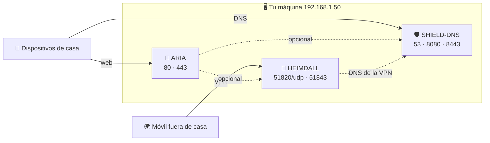
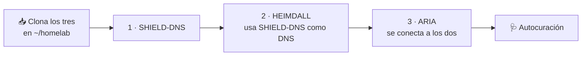

<p align="center">
  <sub>Parte del ecosistema ARIA&nbsp;&nbsp;·&nbsp;&nbsp;<a href="https://github.com/BertMarti/ARIA">🤖 ARIA</a>&nbsp;&nbsp;·&nbsp;&nbsp;<a href="https://github.com/BertMarti/SHIELD-DNS">🛡️ SHIELD-DNS</a>&nbsp;&nbsp;·&nbsp;&nbsp;<a href="https://github.com/BertMarti/HEIMDALL">🔐 HEIMDALL</a></sub>
  <br>
  <a href="../README.md">🏠 README</a>&nbsp;&nbsp;·&nbsp;&nbsp;<b>📘 Instalación</b>&nbsp;&nbsp;·&nbsp;&nbsp;<a href="USO.md">🧭 Uso</a>&nbsp;&nbsp;·&nbsp;&nbsp;<a href="MODULOS.md">🧩 Módulos</a>&nbsp;&nbsp;·&nbsp;&nbsp;<a href="PLAN.md">🗺️ Hoja de ruta</a>
</p>

# Instalación paso a paso

Esta guía es para ti si nunca has montado un servidor en casa. Vas a instalar ARIA en una Raspberry Pi o en un PC con Linux, entrar desde el navegador y, si quieres, conectarla con el bloqueador de anuncios (SHIELD-DNS), la VPN (HEIMDALL), Telegram y tu propio dominio.

En los ejemplos usamos estas direcciones inventadas. Cámbialas por las tuyas:

| Ejemplo | Qué es |
|---|---|
| `192.168.1.50` | La máquina donde instalas ARIA (tu «servidor») |
| `192.168.1.1` | Tu router |
| `tu-dominio.com` | Tu dominio, si tienes uno (opcional) |
| `tu@email.com` | Tu email |

## Índice

1. [Qué vas a montar](#1-qué-vas-a-montar)
2. [Elige el hardware](#2-elige-el-hardware)
3. [Prepara el sistema](#3-prepara-el-sistema)
4. [Instala Docker](#4-instala-docker)
5. [Instala ARIA](#5-instala-aria)
6. [Claves gratuitas de IA (opcional)](#6-claves-gratuitas-de-ia-opcional)
7. [Ajusta ARIA a tu red](#7-ajusta-aria-a-tu-red)
8. [Entrar desde casa sin avisos de certificado](#8-entrar-desde-casa-sin-avisos-de-certificado)
9. [Entrar desde fuera con tu dominio (opcional)](#9-entrar-desde-fuera-con-tu-dominio-opcional)
10. [SHIELD-DNS como DNS de tu router](#10-shield-dns-como-dns-de-tu-router)
11. [HEIMDALL: abrir el puerto de la VPN](#11-heimdall-abrir-el-puerto-de-la-vpn)
12. [Telegram y notificaciones push](#12-telegram-y-notificaciones-push)
13. [Copias de seguridad diarias y cifradas](#13-copias-de-seguridad-diarias-y-cifradas)
14. [Autocuración](#14-autocuración)
15. [Actualizar](#15-actualizar)
16. [Desinstalar](#16-desinstalar)
17. [Problemas frecuentes](#17-problemas-frecuentes)

## 1. Qué vas a montar

- **ARIA**: el asistente y panel central. Es lo único imprescindible.
- **SHIELD-DNS** (opcional): bloquea anuncios y rastreadores en todos los dispositivos de casa. ARIA lo usa también para el inventario de red y el control parental.
- **HEIMDALL** (opcional): una VPN para entrar en tu casa desde fuera y llevarte el bloqueo de anuncios en el móvil.

Las tres pueden convivir en la misma máquina: cada una usa sus propios puertos.



## 2. Elige el hardware

| Opción | Va bien si… | Comentario |
|---|---|---|
| **Raspberry Pi 5 de 8 GB** | Quieres algo pequeño, silencioso y que gaste poco | La opción de referencia; con SSD por USB o NVMe mejor que con tarjeta SD |
| **Raspberry Pi 4/5 de 4 GB** | Vas a usar sobre todo los cerebros en la nube | Usa un modelo local pequeño (`llama3.2:1b`) y baja `OLLAMA_MEM_LIMIT` |
| **Mini-PC o PC viejo con Linux** (x86-64) | Tienes uno por casa | Más potencia para el modelo local; gasta más luz |
| **Windows (WSL2 / Docker Desktop)** | Solo para probar | No probado. La red de casa (escáner, DNS, VPN) no funciona bien dentro de WSL2 |

**Lo que de verdad importa es la RAM.** ARIA arranca varios contenedores, y el más pesado es **Ollama**, que ejecuta el modelo de IA local (hasta 5 GB por defecto):

- El modelo local es el **respaldo**: solo responde cuando los cerebros gratuitos de la nube fallan. Es lento en una Raspberry Pi (decenas de segundos si usa herramientas).
- El contenedor de Ollama **siempre está**, porque también hace de puente con Ollama Cloud. Lo que sí puedes hacer es no descargar el modelo (`SKIP_MODEL=1`) o elegir uno pequeño.
- Si tienes poca RAM, en `.env` baja `OLLAMA_MEM_LIMIT` (por ejemplo a `3g`) y `ARIA_NUM_CTX` (por ejemplo a `2048`).

**Disco**: deja al menos 16 GB libres. Las imágenes de Docker ocupan unos 10 GB y el modelo local por defecto unos 2 GB.

## 3. Prepara el sistema

1. **Instala el sistema operativo.** En una Raspberry Pi, usa [Raspberry Pi Imager](https://www.raspberrypi.com/software/) y elige **Raspberry Pi OS (64-bit)**. En el asistente puedes activar SSH y poner usuario y contraseña. En un PC, Debian o Ubuntu Server valen.
2. **Conéctala por cable** al router si puedes: es más estable.
3. **Dale una IP fija.** En el router, busca «DHCP», «Reserva de direcciones» o «IP estática» y reserva una IP para la máquina (por ejemplo `192.168.1.50`). Así ARIA, el DNS y la VPN no cambian de dirección.
4. **Entra en la máquina** (con teclado y pantalla, o por SSH desde otro ordenador):
   ```bash
   ssh tu-usuario@192.168.1.50
   ```
5. **Actualiza el sistema** e instala `git`:
   ```bash
   sudo apt update && sudo apt full-upgrade -y
   sudo apt install -y git openssl
   ```

## 4. Instala Docker

El instalador de ARIA te ofrece instalar Docker si falta, pero puedes hacerlo antes:

```bash
curl -fsSL https://get.docker.com | sh
sudo usermod -aG docker "$USER"
```

**Cierra la sesión y vuelve a entrar** (o reinicia) para que tu usuario pueda usar Docker. Comprueba que funciona:

```bash
docker compose version
docker run --rm hello-world
```

## 5. Instala ARIA

Recomendamos usar la carpeta `~/homelab`: los scripts de copias de seguridad y de Cloudflare la esperan ahí, y ARIA encuentra solas a SHIELD-DNS y HEIMDALL si están a su lado.

### Opción A: solo ARIA

```bash
mkdir -p ~/homelab && cd ~/homelab
git clone https://github.com/BertMarti/ARIA.git
cd ARIA
./install.sh
```

### Opción B: ARIA + SHIELD-DNS + HEIMDALL de una vez

```bash
curl -fsSL https://raw.githubusercontent.com/BertMarti/ARIA/main/instalar-todo.sh | bash
```

`instalar-todo.sh` clona los tres repositorios en `~/homelab` y los instala en este orden: SHIELD-DNS, HEIMDALL y ARIA (así HEIMDALL usa SHIELD-DNS como DNS y ARIA se conecta a los dos). También activa la [autocuración](#14-autocuración).



Opciones, como variables delante del comando:

| Variable | Qué hace |
|---|---|
| `HOMELAB_DIR=/otra/carpeta` | Clona en otra carpeta (por defecto `~/homelab`) |
| `SOLO="SHIELD-DNS ARIA"` | Instala solo las aplicaciones indicadas |
| `COPIAS_AUTOMATICAS=1` | Activa también las [copias diarias cifradas](#13-copias-de-seguridad-diarias-y-cifradas) |

Por ejemplo:

```bash
curl -fsSL https://raw.githubusercontent.com/BertMarti/ARIA/main/instalar-todo.sh | SOLO="SHIELD-DNS ARIA" bash
```

Si la máquina no tenía Docker, el script lo instala, pero tu sesión aún no tiene permiso para usarlo y la instalación puede pararse con «No puedo hablar con Docker». Cierra sesión, vuelve a entrar y repite el mismo comando: es seguro repetirlo.

### Qué hace `install.sh`

Puedes ejecutarlo tantas veces como quieras: no borra nada.

1. Comprueba Docker.
2. Crea `.env` (si no existe) con una contraseña y un secreto aleatorios y la IP de la máquina.
3. Genera la clave interna del buscador y las claves de las notificaciones push.
4. Publica el nombre `aria.local` en tu red (si el sistema tiene `avahi-daemon`, como Raspberry Pi OS).
5. Si encuentra `../SHIELD-DNS/.env` y `../HEIMDALL/.env`, copia sus contraseñas para conectarse a ellos.
6. Construye y arranca los contenedores y espera a que estén sanos (la primera vez tarda varios minutos).
7. Descarga el modelo local (`ARIA_MODEL`, unos 2 GB). Para saltártelo: `SKIP_MODEL=1 ./install.sh`.
8. Muestra la dirección, el usuario y la contraseña.

### Primer acceso

1. Desde un ordenador o móvil de tu red, abre **https://aria.local**. Si no carga, usa la IP: **https://192.168.1.50**. Si instalaste SHIELD-DNS y ya es el DNS de tu router, también vale **https://aria.lan**.
2. El navegador dirá que «la conexión no es privada». Es normal la primera vez: ARIA usa un certificado propio. Pulsa **Avanzado → Continuar**. En el [paso 8](#8-entrar-desde-casa-sin-avisos-de-certificado) quitarás el aviso para siempre.
3. Inicia sesión con:
   - **Usuario**: `admin`
   - **Contraseña**: la que mostró el instalador. Si no la apuntaste, está en el archivo `.env`:
     ```bash
     grep ARIA_PASSWORD ~/homelab/ARIA/.env
     ```
4. Cámbiala en **Ajustes → Contraseña** (mínimo 10 caracteres). La nueva se guarda cifrada en `data/` y tiene prioridad sobre la de `.env`.
5. En el móvil, abre el menú del navegador y pulsa **Añadir a pantalla de inicio** (o **Instalar aplicación**) para tenerla como una app.

Las contraseñas de SHIELD-DNS y HEIMDALL están en el `.env` de sus carpetas. No hace falta memorizarlas: en Inicio de ARIA tienes «Copiar contraseña».

## 6. Claves gratuitas de IA (opcional)

Sin claves, ARIA responde con el modelo local: funciona, pero en una Raspberry Pi es lento. Con una o varias de estas cuentas gratuitas, las respuestas llegan en uno o dos segundos. Puedes poner todas: si una agota su cuota gratuita, ARIA pasa a la siguiente.

| Servicio | Dónde se consigue | Qué pones en ARIA | Para qué más sirve |
|---|---|---|---|
| **Ollama Cloud** | Crea una cuenta en [ollama.com](https://ollama.com) | No es una clave: conecta tu cuenta con `docker exec -it aria-ollama ollama signin` y abre el enlace que te muestra | Primer cerebro de la cadena |
| **Groq** | [console.groq.com/keys](https://console.groq.com/keys) → *Create API Key* | `GROQ_API_KEY=` en `.env` | Transcribir tu voz y visión de respaldo |
| **Google Gemini** | [aistudio.google.com/apikey](https://aistudio.google.com/apikey) → *Create API key* | `GEMINI_API_KEY=` en `.env` | La voz de ARIA («Leda») y la visión (fotos) |

Para poner las claves:

```bash
cd ~/homelab/ARIA
nano .env                 # rellena GROQ_API_KEY= y/o GEMINI_API_KEY=
docker compose up -d      # aplica los cambios
```

En **Ajustes → Cerebros** verás «clave configurada» o «falta la clave» para cada uno, podrás cambiar el orden y pulsar **Probar**.

> **Privacidad**: con los cerebros de la nube, tus mensajes salen de casa hacia esas empresas. En el plan gratuito de Gemini, Google puede usarlos para mejorar sus productos. Si prefieres que todo se quede en casa, desactívalos en Ajustes → Cerebros.

## 7. Ajusta ARIA a tu red

Abre `.env` (`nano ~/homelab/ARIA/.env`) y revisa estas líneas. Los valores que trae `.env.example` son de ejemplo y casi seguro no coinciden con tu casa:

```bash
# La red de tu casa: la única que ARIA puede escanear. Suele ser la de tu IP terminada en .0/24
ARIA_RED_PERMITIDA=192.168.1.0/24
# Tu router (nunca se puede pausar con el control parental)
ARIA_ROUTER_IP=192.168.1.1
# Si NO vas a usar un dominio propio, déjala vacía (si no, recibirás avisos de «no se puede entrar desde fuera»)
ARIA_URL_PUBLICA=
# Direcciones de SHIELD-DNS y HEIMDALL: con la IP de TU máquina, o vacías (ARIA usa entonces ARIA_LAN_IP)
SHIELD_URL=http://192.168.1.50:8080
VPN_URL=https://192.168.1.50:51843
```

Opcional:

```bash
ARIA_CIUDAD="Madrid"      # el tiempo en el resumen de buenos días
ARIA_NOMBRE_USUARIO=Ana   # cómo te llama ARIA
```

Aplica con `docker compose up -d`.

¿No sabes tu red? Mira la IP de la máquina con `hostname -I`. Si es `192.168.1.50`, tu red es `192.168.1.0/24` y tu router suele ser `192.168.1.1`.

## 8. Entrar desde casa sin avisos de certificado

ARIA cifra la conexión con su propio certificado. Para que el navegador deje de avisar, instala ese certificado una vez en cada dispositivo:

1. En ARIA, con un usuario administrador, ve a **Ajustes → Certificado** y pulsa **Descargar certificado**.
2. Instálalo siguiendo las instrucciones de la propia tarjeta:
   - **Windows**: abre el archivo → *Instalar certificado* → *Equipo local* → *Colocar en el siguiente almacén* → *Entidades de certificación raíz de confianza*.
   - **Android**: *Ajustes → Seguridad → Más ajustes → Cifrado y credenciales → Instalar un certificado → Certificado de CA*.
   - **iPhone/iPad**: abre el archivo, ve a *Ajustes → Perfil descargado → Instalar* y después *Ajustes → General → Información → Ajustes de confianza de certificados* y actívalo.
   - **Mac**: ábrelo con *Acceso a Llaveros*, márcalo como *Confiar siempre*.
   - **Firefox**: *Ajustes → Privacidad y seguridad → Certificados → Ver certificados → Autoridades → Importar*.
3. Cierra y vuelve a abrir el navegador.

Los nombres con los que puedes entrar son los de `ARIA_HOSTS` en `.env`. Si quieres usar otro nombre de tu red, añádelo ahí y ejecuta `docker compose up -d`.

**El micrófono solo funciona por HTTPS**, así que esto también ayuda a usar la voz sin avisos.

## 9. Entrar desde fuera con tu dominio (opcional)

Si tienes un dominio gestionado en Cloudflare (plan gratuito), puedes usar ARIA desde cualquier sitio en `https://aria.tu-dominio.com`, con certificado válido y **sin abrir puertos** en el router. Cloudflare Access pide primero un código que llega a tu email, y solo después se ve ARIA.

El script `cloudflare/configurar.sh` publica tres direcciones:

| Dirección | Lleva a |
|---|---|
| `https://aria.tu-dominio.com` | ARIA |
| `https://shield.tu-dominio.com` | Panel de SHIELD-DNS |
| `https://heimdall.tu-dominio.com` | Panel de HEIMDALL |

Y además mantiene `vpn.tu-dominio.com` apuntando a la IP pública de tu casa (útil para la VPN, ver [paso 11](#11-heimdall-abrir-el-puerto-de-la-vpn)).

### Pasos en Cloudflare

1. Añade tu dominio a Cloudflare (o cómpralo allí).
2. Activa **Zero Trust** con el plan **Free**.
3. En *Zero Trust → Integrations → Identity providers → Add*, añade **One-time PIN** (código por email).
4. En *Mi perfil → API Tokens → Create Token*, crea un token con estos permisos:
   - *Zone · DNS · Edit*
   - *Account · Cloudflare Tunnel · Edit*
   - *Account · Access: Apps and Policies · Edit*
5. Apunta tu **Account ID** (aparece en la página de inicio de tu dominio en Cloudflare).

### Pasos en tu máquina

1. Crea el archivo `~/homelab/cloudflare.env` (fuera del repositorio, para que nunca se suba a git):
   ```bash
   nano ~/homelab/cloudflare.env
   ```
   ```bash
   CLOUDFLARE_API_TOKEN=pega-aqui-tu-token
   CLOUDFLARE_ACCOUNT_ID=pega-aqui-tu-account-id
   DOMINIO=tu-dominio.com
   # Emails que pueden entrar (separados por comas)
   EMAIL_ACCESO=tu@email.com
   ```
   ```bash
   chmod 600 ~/homelab/cloudflare.env
   ```
2. Con ARIA en marcha, ejecuta:
   ```bash
   cd ~/homelab/ARIA
   ./cloudflare/configurar.sh
   ```
   Crea el túnel, las rutas, la protección de Access (antes de publicar nada), los nombres DNS y arranca los contenedores `cloudflare-tunnel` y `cloudflare-ddns`. Puedes repetirlo sin problema.
3. En `.env` de ARIA, pon tu dirección pública (y **no** añadas tu dominio a `ARIA_HOSTS`):
   ```bash
   ARIA_URL_PUBLICA=https://aria.tu-dominio.com
   ```

### Calendario suscrito desde fuera de casa (opcional)

Si quieres que el calendario del móvil se actualice con tu agenda de ARIA también fuera de casa (Agenda → Sincronizar), Cloudflare Access debe dejar pasar esa ruta, porque las apps de calendario no pueden iniciar sesión:

1. Zero Trust → Access → Applications → tu aplicación de ARIA → **Add an application** de tipo *Self-hosted* para `aria.tu-dominio.com/cal/`.
2. Política con acción **Bypass** e *Include → Everyone*.

Solo se abre `/cal/<token>.ics`, de solo lectura: el token es largo, aleatorio y revocable desde ARIA.

### Inicio de sesión único (SSO)

Para que ARIA no te vuelva a pedir contraseña cuando ya has pasado por Cloudflare Access:

1. En Cloudflare, ve a *Zero Trust → Access → Applications → ARIA* y copia la etiqueta **AUD** (64 caracteres).
2. Busca el dominio de tu equipo (*Team domain*) en la configuración de Zero Trust (*Zero Trust → Settings*). Es algo como `mi-equipo.cloudflareaccess.com`.
3. En `.env`:
   ```bash
   ARIA_CF_ACCESS_TEAM=mi-equipo.cloudflareaccess.com
   ARIA_CF_ACCESS_AUD=pega-aqui-la-etiqueta-aud
   ARIA_ADMIN_EMAILS=tu@email.com
   ```
4. `docker compose up -d`.

ARIA comprueba la firma del token de Cloudflare en cada petición; si tu email es de un usuario activo de ARIA, entras directamente. Los emails de `ARIA_ADMIN_EMAILS` son siempre administradores. Desde casa (`aria.local`, la IP) se sigue entrando con usuario y contraseña.

Para dar acceso a otra persona, invítala en **Ajustes → Usuarios** y añade su email a la política de Access de ARIA en Cloudflare (*Zero Trust → Access → Applications → ARIA → Policies*). ARIA no toca tu cuenta de Cloudflare.

## 10. SHIELD-DNS como DNS de tu router

Si instalaste SHIELD-DNS, falta decirle a tu red que lo use. Cada router es distinto, pero los pasos son parecidos:

1. Entra en el router desde el navegador: normalmente `http://192.168.1.1` (mira la pegatina del router).
2. Busca la configuración **LAN**, **DHCP** o **DNS**.
3. En **DNS primario** (o «servidor DNS que se entrega por DHCP») pon la IP de tu máquina: `192.168.1.50`.
4. En **DNS secundario**, lo mejor es dejarlo vacío o poner también `192.168.1.50`. Si pones uno externo (por ejemplo `1.1.1.1`), algunos dispositivos lo usarán y se saltarán el bloqueo y el control parental.
5. Guarda y reinicia la conexión Wi-Fi de tus dispositivos (o espera a que renueven la IP).

Si tu router **no permite cambiar el DNS**, cámbialo en cada dispositivo (en los ajustes de la red Wi-Fi) o usa el servidor DHCP de Pi-hole (*Settings → DHCP* en su panel, desactivando antes el del router).

**IPv6**: si tu router reparte también un DNS IPv6, algunos dispositivos lo usarán. Si ves que los anuncios no se bloquean, desactiva IPv6 en la LAN del router o el DNS IPv6 que entrega.

Comprueba que funciona abriendo ARIA → **Centro de control → SHIELD-DNS**: el número de consultas debe subir. Más detalles en el [README de SHIELD-DNS](https://github.com/BertMarti/SHIELD-DNS).

## 11. HEIMDALL: abrir el puerto de la VPN

Para conectarte a la VPN desde fuera de casa, el router debe dejar pasar el tráfico de WireGuard hacia tu máquina:

1. Entra en el router (`http://192.168.1.1`).
2. Busca **Reenvío de puertos**, **Port forwarding**, **NAT** o **Servidor virtual**.
3. Crea una regla:
   - Protocolo: **UDP**
   - Puerto externo: **51820**
   - IP interna: **192.168.1.50**
   - Puerto interno: **51820**
4. Guarda.

Notas:

- Es el **único** puerto que hace falta abrir. ARIA y los paneles no se abren a internet (para eso está Cloudflare, paso 9).
- Si tu IP pública cambia, usa `vpn.tu-dominio.com` (lo mantiene `cloudflare-ddns`, paso 9) o DuckDNS (ver el [README de HEIMDALL](https://github.com/BertMarti/HEIMDALL)) como dirección del servidor.
- Si tu operador usa **CG-NAT**, no podrás recibir conexiones desde fuera aunque abras el puerto. Pide a tu operador una IP pública.

Después añade tus dispositivos desde ARIA: **Centro de control → HEIMDALL → Añadir dispositivo**, y escanea el QR con la app WireGuard del móvil.

## 12. Telegram y notificaciones push

### Bot de Telegram

ARIA tiene su propio bot. No abre nada a internet: es ARIA quien pregunta a Telegram cada poco si hay mensajes.

1. En Telegram, abre una conversación con **@BotFather** y envía `/newbot`.
2. Ponle un nombre (por ejemplo «ARIA de casa») y un usuario que termine en `bot`. BotFather te dará un **token**.
3. En `.env`:
   ```bash
   TELEGRAM_BOT_TOKEN=pega-aqui-el-token
   ```
   y aplica con `docker compose up -d`.
4. Comprueba que ARIA ve el bot:
   ```bash
   docker compose exec app python -m aria.telegram --probar
   ```
   Debe mostrar el @usuario del bot.
5. En ARIA, ve a **Ajustes → Avisos → Telegram** y pulsa **Vincular Telegram**. Aparece un código de 6 cifras (válido 10 minutos) y un enlace. Ábrelo en el móvil y pulsa **Iniciar**.

Cada persona vincula su propio Telegram desde su usuario de ARIA. Los chats no vinculados reciben «No te conozco…» y los grupos se ignoran. Los comandos están en la [guía de uso](USO.md#telegram).

### Notificaciones push

Las claves se generan solas al instalar. Para activarlas en un dispositivo:

1. Entra en ARIA con una dirección de certificado válido. Lo más fiable es tu dominio (`https://aria.tu-dominio.com`); por la IP con el aviso de certificado no funcionan.
2. Ve a **Ajustes → Avisos** y pulsa **Activar notificaciones en este dispositivo**.
3. Pulsa **Enviar notificación de prueba**.

En iPhone/iPad hace falta iOS 16.4 o posterior y abrir ARIA desde el icono de la pantalla de inicio (Safari → Compartir → Añadir a pantalla de inicio).

## 13. Copias de seguridad diarias y cifradas

Cada aplicación tiene su `./backup.sh`, que guarda una copia local en su carpeta `backups/`. Pero si la máquina se rompe, las copias se pierden con ella. El script `sistema/instalar-copias.sh` lo soluciona:

- Cada día a las **04:30** ejecuta el `backup.sh` de ARIA, HEIMDALL y SHIELD-DNS (los que estén instalados en `~/homelab`).
- Añade `~/homelab/cloudflare.env` si existe.
- Lo **cifra con AES-256** (gpg) y lo sube a un repositorio **privado** de tu cuenta de GitHub, `tu-usuario/homelab-copias`. Guarda las 14 últimas.

### Activarlo

1. Instala las herramientas y entra en GitHub:
   ```bash
   sudo apt install -y gh gpg
   gh auth login
   ```
2. Ejecuta:
   ```bash
   cd ~/homelab/ARIA
   ./sistema/instalar-copias.sh
   ```
3. La primera vez te muestra **la contraseña de tus copias**. Guárdala en tu gestor de contraseñas: sin ella no se pueden abrir. También queda en `~/homelab/.clave-copias`, pero si pierdes la máquina, la pierdes con ella.

Comprobar: `journalctl -t homelab-copias`. Copia manual: `./sistema/copia-diaria.sh`. ARIA te avisa si la última copia tiene más de 36 horas.

### Restaurar en una máquina nueva

```bash
gh auth login
gh repo clone tu-usuario/homelab-copias copias && cd copias
gpg -d homelab-AAAAMMDD-HHMM.tar.gz.gpg | tar -xzf -     # pide la contraseña de las copias
```

Dentro de `homelab/` tendrás la copia de cada aplicación. Instala todo de nuevo y restaura cada una:

```bash
curl -fsSL https://raw.githubusercontent.com/BertMarti/ARIA/main/instalar-todo.sh | bash
cp homelab/cloudflare.env ~/homelab/ 2>/dev/null || true
cp homelab/shield-dns-*.tar.gz ~/homelab/SHIELD-DNS/ && (cd ~/homelab/SHIELD-DNS && ./restore.sh shield-dns-*.tar.gz)
cp homelab/heimdall-*.tar.gz  ~/homelab/HEIMDALL/  && (cd ~/homelab/HEIMDALL  && ./restore.sh heimdall-*.tar.gz)
cp homelab/aria-*.tar.gz      ~/homelab/ARIA/
cd ~/homelab/ARIA && docker compose down && tar -xzf aria-*.tar.gz && ./install.sh
```

La copia de ARIA contiene `.env` y `data/` (usuarios, conversaciones, memoria, finanzas…). No incluye el modelo local: `install.sh` lo vuelve a descargar. Si usabas dominio, repite después `./cloudflare/configurar.sh`.

## 14. Autocuración

```bash
sudo ~/homelab/ARIA/sistema/instalar-autocuracion.sh
```

Instala dos protecciones (`instalar-todo.sh` ya lo hace por ti):

- **Autoheal**: cada 2 minutos reinicia los contenedores que Docker marca como «unhealthy» (colgados). Registro: `journalctl -t homelab-autoheal`.
- **Watchdog**: si el sistema entero se bloquea, la máquina se reinicia sola (si tiene `/dev/watchdog`, como la Raspberry Pi).

### Agente del sistema (sistema en directo y reinicio)

```bash
~/homelab/ARIA/sistema/instalar-host-agente.sh
```

ARIA vive aislada en un contenedor, sin acceso a Docker ni a la máquina. Este pequeño servicio (`aria-host-agente`, solo biblioteca estándar de Python) le da exactamente dos cosas a través de `data/host/`:

- **Telemetría** cada 5 s: CPU, memoria y red por contenedor, y temperatura y carga del sistema (Centro de control → **Sistema en directo** y el HUD).
- **Reinicio bajo petición**: solo si la petición está **firmada** con `ARIA_SECRET` (HMAC-SHA256), tiene menos de 2 minutos y no se ha usado antes. Cualquier otro archivo se borra.

Registro: `journalctl -u aria-host-agente`. Sin el agente, ARIA funciona igual; solo faltan esas dos tarjetas.

### Verificación en dos pasos: rescate

Si alguien pierde el móvil y sus códigos de recuperación, un administrador puede quitarle la verificación en dos pasos:

```bash
cd ~/homelab/ARIA && docker compose exec app python -m aria.dos_pasos desactivar ana@ejemplo.com
```

## 15. Actualizar

```bash
cd ~/homelab/ARIA
./update.sh
```

Descarga el código nuevo (`git pull --ff-only`), las imágenes nuevas, reconstruye los contenedores y espera a que estén sanos. Tus datos y tu `.env` se conservan.

Para actualizar las tres aplicaciones de una vez, vuelve a ejecutar `instalar-todo.sh`: actualiza los repositorios y repite cada instalación. SHIELD-DNS y HEIMDALL tienen además su propio `./update.sh`, que hace una copia antes de actualizar.

Si `git pull` se queja de cambios locales, es que has editado archivos del repositorio. Mira cuáles con `git status`.

## 16. Desinstalar

```bash
cd ~/homelab/ARIA
./uninstall.sh            # quita los contenedores; conserva modelos, certificados y data/
./uninstall.sh --purge    # borra también modelos, certificados y data/ (pide confirmación)
```

El archivo `.env` se conserva en los dos casos; bórralo a mano si quieres. Si usabas Cloudflare, para el conector con:

```bash
cd ~/homelab/ARIA/cloudflare && docker compose --env-file ~/homelab/cloudflare.env down
```

Para quitar los servicios del sistema: `sudo systemctl disable --now homelab-copias.timer homelab-autoheal.timer aria-mdns.service`.

## 17. Problemas frecuentes

| Problema | Qué hacer |
|---|---|
| `install.sh` dice «No puedo hablar con Docker» | Tu usuario aún no está en el grupo `docker`. Cierra sesión, vuelve a entrar y repite. |
| Un contenedor «no está sano» al instalar | Mira sus registros: `docker compose logs app` (o `voz`, `ollama`…). Vuelve a ejecutar `./install.sh`. |
| La página no carga | `docker compose ps` y `docker compose logs caddy app`. Comprueba que nada más usa los puertos 80 y 443 (`sudo ss -tlnp \| grep -E ':80 \|:443 '`). |
| `aria.local` no carga | Usa la IP (`https://192.168.1.50`). Algunos Android y Windows no resuelven `.local`. |
| Error de certificado al entrar con otro nombre | Añade ese nombre a `ARIA_HOSTS` en `.env` y ejecuta `docker compose up -d`. |
| Olvidé la contraseña de `admin` | Si nunca la cambiaste en Ajustes, está en `.env` (`ARIA_PASSWORD`). Si la cambiaste, otro administrador puede ponerte una nueva en Ajustes → Usuarios. |
| «Demasiados intentos» al entrar | Tras 5 fallos se bloquea tu IP 5 minutos. Espera y repite. |
| Las respuestas tardan mucho | Estás usando el cerebro local. Añade una [clave gratuita](#6-claves-gratuitas-de-ia-opcional) o mira Ajustes → Cerebros. |
| «El modelo no está instalado» | Descárgalo en Ajustes → Modelos o con `docker compose exec ollama ollama pull llama3.2:3b`. |
| SHIELD-DNS o HEIMDALL salen «no conectado» | Revisa en el `.env` de ARIA que `SHIELD_URL` y `VPN_URL` llevan la IP de tu máquina ([paso 7](#7-ajusta-aria-a-tu-red)) y que están sus contraseñas (`SHIELD_PASSWORD`, `VPN_USER`, `VPN_PASSWORD`). Si las apps están en `~/homelab`, repite `./install.sh` y copia las contraseñas solo. |
| El micrófono no funciona | Hace falta HTTPS y dar permiso al navegador. Instala el certificado ([paso 8](#8-entrar-desde-casa-sin-avisos-de-certificado)) y revisa el permiso del micrófono del sitio. |
| La voz de ARIA suena distinta | Si Gemini no tiene clave o agotó su cuota, ARIA habla con la voz local. Es lo esperado. |
| No llegan las notificaciones push | Entra por tu dominio con certificado válido y vuelve a activarlas en Ajustes → Avisos. |
| El bot de Telegram no contesta | Comprueba el token con `docker compose exec app python -m aria.telegram --probar` y que vinculaste el chat. |
| Recibo «No se puede entrar en ARIA desde fuera» sin tener dominio | Deja vacía `ARIA_URL_PUBLICA` en `.env` y `docker compose up -d`. |
| El escáner no encuentra nada | Revisa `ARIA_RED_PERMITIDA` y `ARIA_ROUTER_IP` ([paso 7](#7-ajusta-aria-a-tu-red)). |
| Aviso «memory limit capabilities» al arrancar | En la Raspberry Pi el kernel no limita memoria por contenedor. No afecta al funcionamiento. |
| No hay espacio en disco | `docker image prune -f` borra imágenes viejas. En Ajustes → Modelos puedes borrar modelos que no uses. |
