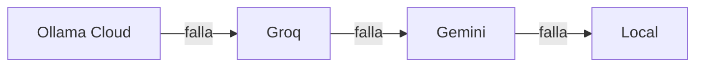

  Parte del ecosistema ARIA&nbsp;&nbsp;·&nbsp;&nbsp;<a href="https://github.com/BertMarti/ARIA">🤖 ARIA</a>&nbsp;&nbsp;·&nbsp;&nbsp;<a href="https://github.com/BertMarti/SHIELD-DNS">🛡️ SHIELD-DNS</a>&nbsp;&nbsp;·&nbsp;&nbsp;<a href="https://github.com/BertMarti/HEIMDALL">🔐 HEIMDALL</a>
   
  <a href="../README.md">🏠 README</a>&nbsp;&nbsp;·&nbsp;&nbsp;<a href="INSTALACION.md">📘 Instalación</a>&nbsp;&nbsp;·&nbsp;&nbsp;<b>🧭 Uso</b>&nbsp;&nbsp;·&nbsp;&nbsp;<a href="MODULOS.md">🧩 Módulos</a>&nbsp;&nbsp;·&nbsp;&nbsp;<a href="PLAN.md">🗺️ Hoja de ruta</a>

# Guía de uso

Esta guía explica qué hay en cada parte de ARIA y cómo sacarle partido en el día a día. Si aún no la has instalado, empieza por la [guía de instalación](INSTALACION.md).

## Índice

1. [Un vistazo rápido](#un-vistazo-rápido)
2. [Inicio](#inicio)
3. [Chat](#chat)
4. [Agentes especializados](#agentes-especializados)
5. [Voz](#voz)
6. [Imágenes y tickets](#imágenes-y-tickets)
7. [Memoria y diario](#memoria-y-diario)
8. [Resumen de buenos días](#resumen-de-buenos-días)
9. [Recordatorios](#recordatorios)
10. [Rutinas](#rutinas)
11. [Finanzas](#finanzas)
12. [Red](#red)
13. [Control parental](#control-parental)
14. [Seguridad](#seguridad)
15. [Centro de control](#centro-de-control)
16. [Ajustes](#ajustes)
17. [Avisos](#avisos)
18. [Telegram](#telegram)
19. [Notificaciones push](#notificaciones-push)
20. [Atajos: Ctrl+K y Compartir](#atajos-ctrlk-y-compartir)
21. [Usuarios y roles](#usuarios-y-roles)
22. [Cuando algo falla](#cuando-algo-falla)

## Un vistazo rápido

La barra de navegación tiene estas secciones:

| Sección | Para qué | Quién la ve |
|---|---|---|
| **Inicio** | Resumen del día, tus aplicaciones y acciones rápidas | Todos |
| **Chat** | Hablar con ARIA | Todos |
| **Finanzas** | Tus gastos, ingresos y presupuestos | Todos (cada uno los suyos) |
| **Red** | Dispositivos de casa, velocidad y control parental | Administradores |
| **Seguridad** | Escaneo defensivo de la red | Administradores |
| **Control** | Centro de control de SHIELD-DNS, HEIMDALL y el sistema | Administradores |
| **Ajustes** | Voz, memoria, avisos, rutinas, usuarios, módulos… | Todos (con más opciones para administradores) |

Arriba a la derecha está la **campana** de avisos.

## Inicio

Es la página que ves al entrar.

- **«Pregúntale a ARIA»**: escribe (o pulsa el micrófono) y se abre un chat con tu pregunta.
- **Tu resumen de hoy**: el [resumen de buenos días](#resumen-de-buenos-días). Puedes cerrarlo por hoy o actualizarlo.
- **Aplicaciones**: un mosaico por aplicación (Chat, SHIELD-DNS, HEIMDALL y los [módulos](MODULOS.md) que tengas). El punto de color dice si está **activa**, **caída** o **sin instalar**. Al pulsar, se abre en una pestaña nueva. En SHIELD-DNS y HEIMDALL, **Copiar contraseña** te ahorra teclearla en su panel (solo administradores).
- **Acciones rápidas** (administradores): *Pausar anuncios 5 min*, *Reanudar anuncios*, *Añadir dispositivo a la VPN* y *Estado del sistema*.
- **Sistema**: temperatura, memoria, disco y carga de la máquina.

## Chat

- Escribe abajo y pulsa **Enviar**. La respuesta llega en directo; **Detener** la corta.
- A la izquierda (en el móvil, con el botón ☰) están tus conversaciones: **+ Nueva**, renombrar y borrar.
- Cada respuesta lleva insignias con el **cerebro** que la dio (Ollama Cloud, Groq, Gemini o local) y el **agente**.
- En la cabecera eliges el **agente** de la conversación (o «ARIA (automático)»).
- Junto a la caja de texto tienes el **micrófono**, **Manos libres** y el botón de **imagen**.
- **Copiar** copia un mensaje; **Leer** lo lee en voz alta.

### Frases de ejemplo

| Tema | Prueba a decir |
|---|---|
| Casa | «¿Cuántos anuncios has bloqueado hoy?» · «Pausa el bloqueador 10 minutos» · «¿Qué temperatura tiene la Raspberry?» |
| VPN | «¿Qué dispositivos hay en la VPN?» · «Añade un dispositivo a la VPN llamado movil-ana» · «Desactiva el portátil de Lucía» |
| Internet | «¿Qué noticias hay hoy de tecnología?» · «Busca el horario del museo del Prado» |
| Enlaces | Pega un enlace y escribe «resúmelo» |
| Tiempo | «¿Qué tiempo hace en Madrid?» |
| Recordatorios | «Recuérdame mañana a las 9 llamar al taller» |
| Rutinas | «Crea una rutina que de lunes a viernes a las 7:30 me diga el tiempo» |
| Memoria | «Recuerda que mi equipo es el Atlético» · «Olvida lo del equipo» |
| Finanzas | «Apunta 12,50 € en el supermercado» · «¿Cuánto llevo gastado este mes?» |
| Red | «¿Hay dispositivos nuevos en la red?» · «Haz un test de velocidad» |
| Módulos | «¿Responde example.org?» (módulo *uptime*) |

Por seguridad, **borrar dispositivos de la VPN solo se puede hacer desde la interfaz**, con confirmación: el chat no puede.

## Agentes especializados

Además de ARIA (general), hay tres agentes con su propio oficio:

| Agente | Para qué | Quién |
|---|---|---|
| **ARIA** | Charla, la casa, la VPN, el bloqueador, búsquedas… | Todos |
| **@finanzas** | Gastos, ingresos, categorías y presupuestos (siempre los tuyos) | Todos |
| **@redes** | Dispositivos de la LAN, latencia, velocidad, DNS, VPN y control parental | Administradores (un usuario solo consulta la salud de la red) |
| **@seguridad** | Informe defensivo: puertos, servicios de riesgo, vulnerabilidades | Solo administradores |

Cómo elegir:

- **Automático**: con «ARIA (automático)», ARIA decide según lo que escribas.
- **En la cabecera del chat**: el agente queda fijado para esa conversación.
- **Con un prefijo**, solo para un mensaje: `@finanzas ¿cuánto llevo en restaurantes?`, `@redes ¿qué dispositivos están pausados?`, `@seguridad haz un informe`, `@aria`.

## Voz

> El micrófono solo funciona por HTTPS y el navegador te pedirá permiso la primera vez.

- **Pulsar para hablar**: mantén pulsado el micrófono mientras hablas y suelta (o toca una vez para empezar y otra para terminar). Máximo 30 segundos. El texto se envía solo.
- **Leer**: el botón de cada respuesta la lee en voz alta. En **Ajustes → Voz** puedes hacer que lea todas las respuestas y cambiar la velocidad.
- **Manos libres**: pulsa **Manos libres** en el chat (o actívalo en Ajustes → Voz o con Ctrl+K). Aparece un aviso «escuchando "Aria"» con el botón **Dejar de escuchar**. Di «**Aria**» y tu pregunta («Aria, ¿qué hora es?»), o «Aria», una pausa corta y la pregunta. Suena un pitido, ARIA escucha hasta que te callas, responde y lo lee.
  - «Aria» solo cuenta al principio de una frase: «María» o «esta aria de ópera» no la activan.
  - El micrófono se apaga al cambiar de pestaña o bloquear el móvil.
- **Ajustes → Voz**: elegir micrófono y probarlo, leer en voz alta, manos libres y velocidad. Se guardan en cada dispositivo.

Privacidad: para detectar «Aria», el sonido va a tu máquina (nunca fuera). Lo que dices después se transcribe con Groq (o en tu máquina si no hay clave). **El audio no se guarda nunca.**

## Imágenes y tickets

- En el chat, pulsa el botón de **imagen**, **pega** una captura (Ctrl+V) o **arrástrala**. Puedes añadir una pregunta o enviarla sin texto.
- El navegador reduce la foto y le quita los datos de ubicación antes de enviarla.
- **Tickets**: si la foto es un ticket, factura o recibo (o pides «apúntalo»), ARIA lee comercio, fecha, total y categoría y **te propone** apuntar el gasto con **Registrar gasto** / **Descartar**. Nada se apunta sin pulsar.
- La visión usa Gemini y, de respaldo, Groq. El modelo local no ve imágenes: sin esas claves, ARIA te lo dirá.
- Límite: 6 imágenes por minuto y 60 por hora por persona. **Las imágenes no se guardan**: en el historial queda «Imagen» y tu texto.

## Memoria y diario

- **Recuerdos**: «recuerda que soy alérgica al marisco», «olvida que…». También en **Ajustes → Memoria**, donde los ves, editas y borras. Cada persona tiene los suyos (hasta 200).
- **Aprendizaje automático** (interruptor en Ajustes → Memoria): tras cada mensaje, ARIA puede guardar hasta 3 datos duraderos sobre ti. Nunca guarda contraseñas, claves, tarjetas ni documentos de identidad. Solo lo hace con un cerebro de la nube.
- **Diario**: cada madrugada ARIA resume en unas viñetas lo que hiciste ese día. En Ajustes → Memoria ves los últimos 14 días y puedes borrar cualquiera.
- **«Borrar toda mi memoria»** elimina recuerdos y diario.

La memoria se envía a los cerebros de la nube junto con tus preguntas para darte contexto. Al cerebro local solo le llega un trozo pequeño.

## Resumen de buenos días

En **Inicio**, la tarjeta «Tu resumen de hoy» reúne: saludo y fecha, tu resumen de ayer, anuncios bloqueados ayer, el tiempo (si pusiste `ARIA_CIUDAD`), el estado de la máquina, algún recuerdo que venga al caso y, para administradores, la VPN y la última copia de seguridad.

- En el **chat**, el primer «hola» o «buenos días» del día se responde con una versión hablada del resumen.
- Por **Telegram** o **notificación** a la hora que elijas (por defecto, las 08:00): actívalo en Ajustes → Avisos.

## Recordatorios

Pídeselos a ARIA en el chat o por Telegram:

- «Recuérdame mañana a las 9 llamar al taller»
- «Avísame en 20 minutos»
- «Todos los lunes a las 8 sacar la basura» (también diarios o de lunes a viernes)
- «¿Qué recordatorios tengo?» · «Borra el recordatorio 3»

También se ven y se crean en **Ajustes → Recordatorios**. Llegan por la campana, Telegram y notificación, incluso en horas de silencio.

## Rutinas

Una rutina es una pregunta que ARIA se hace sola a una hora y te manda la respuesta. Por ejemplo: «cada mañana a las 8, dime el tiempo en Madrid y 3 titulares de tecnología».

- **Dónde**: **Ajustes → Rutinas** (crear, editar, pausar, borrar y **Ejecutar ahora**), en el chat («crea una rutina…», «¿qué rutinas tengo?», «borra la rutina del tiempo»), en Telegram con `/rutinas` y con **Ctrl+K**.
- **Cuándo**: todos los días a una hora, ciertos días («los lunes y jueves a las 9», «de lunes a viernes», «los fines de semana») o cada N horas (mínimo cada hora).
- **Entrega**: Telegram, notificación, ambos o solo la campana. El resultado completo queda en la conversación «Rutina · nombre».
- **Solo consultan**: una rutina puede mirar el tiempo, noticias, el estado de la casa o tus finanzas, pero nunca cambia nada (no pausa el bloqueador, no toca la VPN, no apunta gastos…).
- Necesitan un **cerebro de la nube**: si solo responde el local, la rutina se salta y te deja una nota.
- Límite: 10 rutinas por persona.

## Finanzas

Tus cuentas personales. Cada usuario solo ve las suyas. ARIA **no se conecta a ningún banco** ni da consejos de inversión.

- **Resumen del mes** y **Gastos por categoría**.
- **Presupuestos mensuales** por categoría, con su barra de progreso.
- **Apuntar movimiento**: fecha, concepto, importe (negativo = gasto) y categoría. O desde el chat: «apunta 30 € de gasolina».
- **Movimientos**: buscar, filtrar por mes y categoría, editar. Al editar puedes marcar «aplicar a movimientos parecidos» y se crea una regla.
- **Importar extracto CSV**:
  1. Descarga los movimientos de tu banco en CSV (si solo da Excel, ábrelo y guárdalo como CSV).
  2. Pulsa **Importar extracto CSV** y elige el archivo (máximo 2 MB).
  3. ARIA detecta el formato. Revisa qué columna es la fecha, el concepto y el importe, y mira la vista previa.
  4. Pulsa **Importar**. Lo que ya estaba no se duplica.
- **Sugerir categorías (nube)**: opcional. Envía solo los conceptos sin categoría (sin importes ni fechas) a un cerebro de la nube. Nada se aplica hasta que aceptas cada sugerencia.

## Red

Solo para administradores. Necesita SHIELD-DNS para ver los dispositivos.

- **Salud**: latencia al router y a internet, DNS, VPN y la última velocidad.
- **Medir latencia** y **Test de velocidad** (descarga ~15 MB y sube ~5 MB; uno cada 10 minutos).
- **Historial (7 días)**: gráfica de las mediciones.
- **Dispositivos de la LAN**: nombre, IP, fabricante, MAC, puertos y cuándo se vio. Lo desconocido aparece resaltado. Ponle un alias o márcalo como conocido (o **Marcar todos como conocidos** la primera vez).
- Botón **Control** de cada dispositivo: el [control parental](#control-parental).

## Control parental

Por dispositivo, desde **Red → Control**, desde el agente **@redes** o con `/control` en Telegram. Solo administradores.

- **Pausar internet**: 30 min, 1 h, 2 h, 4 h o hasta que lo reanudes.
- **Bloquear servicios**: TikTok, YouTube, Instagram, Facebook, WhatsApp, Snapchat, X, Twitch, Discord, Fortnite/Epic, Roblox, Minecraft, Steam, Netflix, Disney+ y Prime Video.
- **Horarios**: «sin internet de 23:00 a 08:00 de lunes a viernes» o «sin TikTok de 16:00 a 20:00».
- Frases para @redes: «pausa la tablet de Lucía una hora», «bloquea TikTok en el móvil de Ana», «¿qué dispositivos están pausados?».

Siempre actúa sobre **un** dispositivo concreto: no hay «pausar a todos». El router, la propia máquina de ARIA y las IP de `ARIA_CONTROL_PROTEGIDOS` nunca se pueden pausar.

> **Límite importante: es un bloqueo por DNS.** Funciona porque el dispositivo pregunta a SHIELD-DNS por cada web. No frena a un dispositivo que:
> - tenga un DNS fijo distinto (por ejemplo `8.8.8.8`);
> - use DNS cifrado (DoH/DoT, el «DNS privado» de Android, iCloud Private Relay);
> - use una VPN;
> - use el DNS secundario del router, si pusiste uno externo.
>
> Además, el dispositivo puede tardar unos minutos en notar el cambio. Para un corte total, bloquea el dispositivo en el router.

## Seguridad

Solo para administradores. Un escaneo **defensivo** de tu red de casa:

- **Escanear ahora (100 puertos)** o **Escaneo completo (1000 puertos)**. Como mucho uno cada 10 minutos, y uno automático cada domingo de madrugada.
- **Resumen** y **Hallazgos** con gravedad (alta, media, baja): servicios de riesgo abiertos (Telnet, SMB, escritorio remoto, VNC, UPnP, bases de datos…), paneles web sin HTTPS, puertos nuevos, dispositivos sin reconocer, versiones con vulnerabilidades conocidas y dispositivos VPN que no se usan.
- **Lo más bloqueado por dispositivo** (Pi-hole, últimas 24 h).
- O pregunta a `@seguridad`: «¿hay algo peligroso en mi red?».

Qué **no** hace: no ataca, no prueba contraseñas, no explota fallos y no escanea fuera de `ARIA_RED_PERMITIDA`. Tampoco mira tu casa desde internet: revisa en el router que solo esté abierto el puerto de la VPN (51820/UDP) y que la gestión remota esté desactivada.

## Centro de control

Solo para administradores. Tarjetas que se actualizan solas cada 15 segundos:

- **SHIELD-DNS**: consultas, bloqueos y porcentaje. **Pausar 5/30/60 min** y **Reanudar**.
- **HEIMDALL**: dispositivos de la VPN y cuáles están conectados.
  - **Añadir dispositivo**: escribe un nombre, pulsa **Crear** y escanea el QR con la app WireGuard del móvil (o **Descargar .conf** para un ordenador).
  - **QR** vuelve a mostrar el código; **Activar/Desactivar** corta o devuelve el acceso; **Eliminar** pide confirmación.
- **Sistema**: temperatura, memoria, disco, carga y tiempo encendida.

Si una aplicación sale «no conectado», revisa su contraseña en `.env` (ver [Problemas frecuentes](INSTALACION.md#17-problemas-frecuentes)).

## Ajustes

Lo que ve cada rol:

| Tarjeta | Qué hay | Quién |
|---|---|---|
| **Usuarios** | Invitar, cambiar rol, activar/desactivar, poner contraseña para casa, eliminar | Administradores |
| **Cerebros** | Orden, activar/desactivar y **Probar** cada cerebro | Administradores |
| **Modelos locales** | Descargar, usar y borrar modelos de Ollama | Administradores |
| **Avisos** | Tipos de aviso, canales, horas de silencio, resumen de buenos días, Telegram y notificaciones | Todos |
| **Recordatorios** | Ver y crear recordatorios | Todos |
| **Rutinas** | Crear, editar, pausar, ejecutar | Todos |
| **Voz** | Micrófono, leer en voz alta, manos libres, velocidad | Todos |
| **Memoria** | Recuerdos, aprendizaje automático y diario | Todos |
| **Contraseña** | Cambiar la tuya (mínimo 10 caracteres) | Todos |
| **Certificado** | Descargar el certificado para quitar el aviso del navegador | Administradores |
| **Módulos** | Aplicaciones integradas y módulos: estado, herramientas y variables que usan | Administradores |
| **Acerca de** | Versión | Administradores |

## Avisos

ARIA vigila la casa en segundo plano y te avisa por la **campana**, por **Telegram** y por **notificación**:

| Aviso | Gravedad |
|---|---|
| SHIELD-DNS o HEIMDALL caídos | Grave |
| No se puede entrar desde fuera (si usas dominio) | Aviso |
| Dispositivo desconocido en la red | Aviso |
| Hallazgo grave en el escaneo de seguridad | Grave |
| Copia de seguridad fuera de casa con más de 36 h | Aviso |
| Temperatura alta, disco casi lleno o poca RAM | Grave / aviso |
| Solo responde el cerebro local durante más de 30 min | Aviso |
| Un dispositivo se conecta a la VPN (apagado por defecto) | Info |
| Empieza o termina un horario de control parental | Info |
| Avisos de tus [módulos](MODULOS.md) | Según el módulo |

Los avisos de la casa solo llegan a los administradores. En **Ajustes → Avisos** cada persona elige qué tipos quiere, por qué canales y sus **horas de silencio** (por defecto 23:00–08:00; los graves y los recordatorios llegan igual). **Probar avisos** manda uno de prueba.

## Telegram

Primero vincula tu chat (ver [instalación](INSTALACION.md#12-telegram-y-notificaciones-push)). Después puedes escribirle a ARIA como en la web: usa tus agentes, tu memoria y tus permisos. También entiende:

- **Fotos**: igual que en la web; los tickets se apuntan con los botones **Registrar** / **Cancelar**.
- **Notas de voz** (hasta 2 minutos): se transcriben. Si activas «Responder también con voz a mis notas de voz» en Ajustes → Avisos, ARIA contesta con audio.
- **Enlaces**: si mandas solo un enlace, aparece el botón **Resumir**.

Comandos:

| Comando | Qué hace |
|---|---|
| `/estado` | Resumen de la casa |
| `/resumen` | Resumen de buenos días |
| `/tiempo` | Previsión del tiempo (`/tiempo Madrid` para otra ciudad) |
| `/recordatorios` | Tus recordatorios |
| `/rutinas` | Tus rutinas, con botones **Ejecutar ahora** y **Pausar** |
| `/gastos` | Gastos de este mes |
| `/red` | Salud de la red y dispositivos nuevos |
| `/vpn` | Dispositivos de la VPN |
| `/bloqueo` | Bloqueador de anuncios, con botones de pausa para administradores (también `/anuncios`) |
| `/nuevovpn <nombre>` | Crea un dispositivo VPN y te manda el QR y el `.conf` (administradores) |
| `/control` | Dispositivos pausados o bloqueados, con botón **Reanudar** (administradores) |
| `/nuevo` | Empieza otra conversación |
| `/desvincular` | Desvincula este chat |
| `/ayuda` | Ayuda |

Las acciones de administración piden **Confirmar**. Cada chat tiene su conversación («Telegram · …» en el historial de la web).

> El `.conf` de `/nuevovpn` contiene la clave privada del dispositivo. Bórralo del chat cuando lo hayas importado.

## Notificaciones push

Avisos en el móvil o el navegador, aunque ARIA esté cerrada. Se activan por dispositivo en **Ajustes → Avisos → Activar notificaciones en este dispositivo**. Ahí ves tus dispositivos (puedes quitarlos) y **Enviar notificación de prueba**. Necesitan entrar por una dirección con certificado válido (tu dominio). Detalles en la [instalación](INSTALACION.md#notificaciones-push).

## Atajos: Ctrl+K y Compartir

### Paleta de órdenes

**Ctrl+K** (⌘K en Mac) abre una paleta para: ir a cualquier sección, abrir Rutinas, Recordatorios o Avisos, empezar una conversación nueva, activar o desactivar manos libres y ejecutar una rutina. Escribe para filtrar, ↑/↓ para moverte, Intro para elegir y Esc para cerrar.

### Compartir con ARIA desde Android

1. Instala ARIA como aplicación: en Chrome, menú → **Instalar aplicación** (o **Añadir a pantalla de inicio**).
2. Desde cualquier app, pulsa **Compartir** y elige **ARIA**.
3. Se abre el chat con lo compartido y eliges **Resume esto** o **¿Qué opinas?**.

Si ya tenías ARIA instalada antes, desinstálala y vuelve a instalarla para que aparezca en el menú. Safari en iPhone no permite esta opción.

## Usuarios y roles

ARIA admite varias personas, cada una con sus conversaciones, memoria, finanzas, recordatorios y rutinas.

| | Administrador | Usuario |
|---|---|---|
| Inicio | Completo, con acciones rápidas y «Copiar contraseña» | Solo estado |
| Chat | Todas las herramientas | Solo consultas (no pausa el bloqueador ni toca la VPN) |
| Agentes | Todos | ARIA, Finanzas y Redes (solo consulta) |
| Finanzas | Las suyas | Las suyas |
| Red, Seguridad, Control | Sí | No |
| Ajustes | Todo | Avisos, recordatorios, rutinas, voz, memoria y contraseña |

Los permisos se comprueban **en el servidor**, no solo ocultando botones.

**Invitar a alguien**: **Ajustes → Usuarios → Invitar usuario** (email, nombre y rol). Para que entre desde casa, pulsa **Poner contraseña para casa**. Si usas Cloudflare Access, añade también su email a la política de ARIA en Cloudflare para que pueda entrar desde fuera. Desde Usuarios puedes cambiar el rol, desactivar (sus sesiones se cierran al momento) o eliminar a alguien. Nunca se puede quitar al último administrador activo.

## Cuando algo falla

ARIA está pensada para seguir funcionando aunque algo se caiga:

- **Cerebros**: si el primero falla (límite gratuito, clave, sin conexión o más de 30 s), pasa al siguiente: Ollama Cloud → Groq → Gemini → local. El que falló por límite se salta un rato (unos 15 minutos o lo que diga el proveedor). Si al final solo queda el local, las respuestas serán más lentas, y si dura más de 30 minutos recibirás un aviso. Puedes ver y probar cada uno en Ajustes → Cerebros.
- **Voz de ARIA**: Gemini («Leda») → voz local en tu máquina (Piper) → voz del navegador.
- **Transcripción**: Groq → Whisper en tu máquina (más lento y menos preciso).
- **Visión**: Gemini → Groq. Sin ninguno, ARIA te dice que ahora no puede ver imágenes.
- **Rutinas**: sin cerebros de la nube, se saltan y te dejan una nota.
- **SHIELD-DNS caído**: lo que pidas en control parental queda guardado y se aplica en cuanto vuelva.
- **Un módulo roto**: queda en «Error» en Ajustes → Módulos y ARIA sigue funcionando.
- **Contenedores colgados**: si instalaste la [autocuración](INSTALACION.md#14-autocuración), se reinician solos.

Si algo sigue sin ir, mira los [problemas frecuentes](INSTALACION.md#17-problemas-frecuentes).
