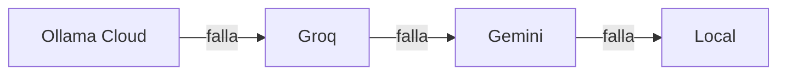

  Parte del ecosistema ARIA&nbsp;&nbsp;·&nbsp;&nbsp;<a href="https://github.com/BertMarti/ARIA">🤖 ARIA</a>&nbsp;&nbsp;·&nbsp;&nbsp;<a href="https://github.com/BertMarti/SHIELD-DNS">🛡️ SHIELD-DNS</a>&nbsp;&nbsp;·&nbsp;&nbsp;<a href="https://github.com/BertMarti/HEIMDALL">🔐 HEIMDALL</a>
   
  <a href="../README.md">🏠 README</a>&nbsp;&nbsp;·&nbsp;&nbsp;<a href="INSTALACION.md">📘 Instalación</a>&nbsp;&nbsp;·&nbsp;&nbsp;<b>🧭 Uso</b>&nbsp;&nbsp;·&nbsp;&nbsp;<a href="MODULOS.md">🧩 Módulos</a>&nbsp;&nbsp;·&nbsp;&nbsp;<a href="PLAN.md">🗺️ Hoja de ruta</a>

# Guía de uso

Esta guía explica qué hay en cada parte de ARIA y cómo sacarle partido en el día a día. Si aún no la has instalado, empieza por la [guía de instalación](INSTALACION.md).

## Índice

1. [Un vistazo rápido](#un-vistazo-rápido)
2. [Inicio](#inicio)
3. [Chat](#chat)
4. [Agentes especializados](#agentes-especializados)
5. [Voz](#voz)
6. [Imágenes y tickets](#imágenes-y-tickets)
7. [Memoria y diario](#memoria-y-diario)
8. [Resumen diario](#resumen-diario)
9. [Recordatorios](#recordatorios)
10. [Rutinas](#rutinas)
11. [Finanzas](#finanzas)
12. [Red](#red)
13. [Control parental](#control-parental)
14. [Seguridad](#seguridad)
15. [Centro de control](#centro-de-control)
16. [Modo HUD](#modo-hud)
17. [Agenda y cumpleaños](#agenda-y-cumpleaños)
18. [Mapa](#mapa)
19. [Información e inversiones](#información-e-inversiones)
20. [Precio de la luz](#precio-de-la-luz)
21. [Ajustes](#ajustes)
22. [Avisos](#avisos)
23. [Telegram](#telegram)
24. [Notificaciones push](#notificaciones-push)
25. [Atajos: Ctrl+K y Compartir](#atajos-ctrlk-y-compartir)
26. [Acceso por invitación](#acceso-por-invitación)
27. [Usuarios y roles](#usuarios-y-roles)
28. [Cuando algo falla](#cuando-algo-falla)

## Un vistazo rápido

La barra de navegación tiene estas secciones:

| Sección | Para qué | Quién la ve |
|---|---|---|
| **Inicio** | Resumen del día, tus aplicaciones y acciones rápidas | Todos |
| **Chat** | Hablar con ARIA | Todos |
| **Finanzas** | Tus gastos, ingresos y presupuestos | Todos (cada uno los suyos) |
| **Información** | Noticias por temas y tus inversiones | Todos |
| **Agenda** | Calendario, eventos y cumpleaños | Todos (cada uno los suyos) |
| **Mapa** | Buscar lugares, rutas y sitios cercanos | Todos |
| **Red** | Dispositivos de casa, velocidad y control parental | Administradores |
| **Seguridad** | Escaneo defensivo de la red | Administradores |
| **Control** | Centro de control de SHIELD-DNS, HEIMDALL y el sistema | Administradores |
| **Ajustes** | Voz, memoria, avisos, rutinas, usuarios, módulos… | Todos (con más opciones para administradores) |

Arriba a la derecha está la **campana** de avisos.

## Inicio

Es la página que ves al entrar.

- **«Pregúntale a ARIA»**: escribe (o pulsa el micrófono) y se abre un chat con tu pregunta.
- **Tu ARIA, en tarjetas numeradas**: *01 Modo HUD*, *02 Resumen del día*, *03 Agenda*, *04 Tu casa* (solo administradores), *05 Información*, *06 Mapa*, *07 Chat* y *08 Finanzas*. Cada tarjeta enseña un dato vivo (el tiempo y la luz, tu próxima cita, los dispositivos de casa y los anuncios atrapados, tus inversiones, lo gastado este mes…) y su estado: **ACTIVO**, **AVISO** si hay algo que mirar o **PRONTO** para lo que está en construcción. Al pulsar una, vas a esa sección; *Resumen del día* te lleva al resumen (y lo vuelve a abrir si lo cerraste).
- **Resumen del día**: tarjetas con el tiempo, tus aplicaciones, la red, tus finanzas, tus inversiones y tu agenda de hoy (ver [Resumen diario](#resumen-diario)). **▶ Escuchar** lo lee ARIA en un minuto ([briefing hablado](#briefing-hablado)); también puedes cerrarlo por hoy o actualizarlo.
- **Aplicaciones**: un mosaico por aplicación (Chat, SHIELD-DNS, HEIMDALL y los [módulos](MODULOS.md) que tengas). El punto de color dice si está **activa**, **caída** o **sin instalar**. Al pulsar, se abre en una pestaña nueva. En SHIELD-DNS y HEIMDALL, **Copiar contraseña** te ahorra teclearla en su panel (solo administradores).
- **Acciones rápidas** (administradores): *Pausar anuncios 5 min*, *Reanudar anuncios*, *Añadir dispositivo a la VPN* y *Estado del sistema*.
- **Sistema**: temperatura, memoria, disco y carga de la máquina.

## Chat

- Escribe abajo y pulsa **Enviar**. La respuesta llega en directo; **Detener** la corta.
- A la izquierda (en el móvil, con el botón ☰) están tus conversaciones: **+ Nueva**, renombrar y borrar.
- Cada respuesta lleva insignias con el **cerebro** que la dio (Ollama Cloud, Groq, Gemini o local) y el **agente**.
- En la cabecera eliges el **agente** de la conversación (o «ARIA (automático)»).
- Junto a la caja de texto tienes el **micrófono**, **Manos libres** y el botón de **imagen**.
- **Copiar** copia un mensaje; **Leer** lo lee en voz alta.

### Frases de ejemplo

| Tema | Prueba a decir |
|---|---|
| Casa | «¿Cuántos anuncios has bloqueado hoy?» · «Pausa el bloqueador 10 minutos» · «¿Qué temperatura tiene la Raspberry?» |
| VPN | «¿Qué dispositivos hay en la VPN?» · «Añade un dispositivo a la VPN llamado movil-ana» · «Desactiva el portátil de Lucía» |
| Internet | «¿Qué noticias hay hoy de tecnología?» · «Busca el horario del museo del Prado» |
| Enlaces | Pega un enlace y escribe «resúmelo» |
| Tiempo | «¿Qué tiempo hace en Madrid?» |
| Recordatorios | «Recuérdame mañana a las 9 llamar al taller» |
| Rutinas | «Crea una rutina que de lunes a viernes a las 7:30 me diga el tiempo» |
| Memoria | «Recuerda que mi equipo es el Atlético» · «Olvida lo del equipo» |
| Finanzas | «Apunta 12,50 € en el supermercado» · «¿Cuánto llevo gastado este mes?» |
| Red | «¿Hay dispositivos nuevos en la red?» · «Haz un test de velocidad» |
| Módulos | «¿Responde example.org?» (módulo *uptime*) |

Por seguridad, **borrar dispositivos de la VPN solo se puede hacer desde la interfaz**, con confirmación: el chat no puede.

## Agentes especializados

Además de ARIA (general), hay tres agentes con su propio oficio:

| Agente | Para qué | Quién |
|---|---|---|
| **ARIA** | Charla, la casa, la VPN, el bloqueador, búsquedas… | Todos |
| **@finanzas** | Gastos, ingresos, categorías y presupuestos (siempre los tuyos) | Todos |
| **@redes** | Dispositivos de la LAN, latencia, velocidad, DNS, VPN y control parental | Administradores (un usuario solo consulta la salud de la red) |
| **@seguridad** | Informe defensivo: puertos, servicios de riesgo, vulnerabilidades | Solo administradores |

Cómo elegir:

- **Automático**: con «ARIA (automático)», ARIA decide según lo que escribas.
- **En la cabecera del chat**: el agente queda fijado para esa conversación.
- **Con un prefijo**, solo para un mensaje: `@finanzas ¿cuánto llevo en restaurantes?`, `@redes ¿qué dispositivos están pausados?`, `@seguridad haz un informe`, `@aria`.

## Voz

> El micrófono solo funciona por HTTPS y el navegador te pedirá permiso la primera vez.

- **Pulsar para hablar**: mantén pulsado el micrófono mientras hablas y suelta (o toca una vez para empezar y otra para terminar). Máximo 30 segundos. El texto se envía solo.
- **Leer**: el botón de cada respuesta la lee en voz alta. En **Ajustes → Voz** puedes hacer que lea todas las respuestas y cambiar la velocidad.
- **Manos libres**: pulsa **Manos libres** en el chat (o actívalo en Ajustes → Voz o con Ctrl+K). Aparece un aviso «escuchando "Aria"» con el botón **Dejar de escuchar**. Di «**Aria**» y tu pregunta («Aria, ¿qué hora es?»), o «Aria», una pausa corta y la pregunta. Suena un pitido, ARIA escucha hasta que te callas, responde y lo lee.
  - «Aria» solo cuenta al principio de una frase: «María» o «esta aria de ópera» no la activan.
  - El micrófono se apaga al cambiar de pestaña o bloquear el móvil.
- **Ajustes → Voz**: elegir micrófono y probarlo, leer en voz alta, manos libres y velocidad. Se guardan en cada dispositivo.

### Elegir la voz de ARIA

En **Ajustes → General → Voz**, apartado **Voz de ARIA**:

- **14 voces femeninas** de Google Gemini, cada una con su carácter (suave, amable, cálida, alegre…). Pulsa **▶** para escuchar una frase de muestra y **Elegir** para quedártela.
- **Tono**: *Dulce y cariñosa* (por defecto), *Alegre*, *Serena* o *Muy tierna*.
- **Acento**: *España* (por defecto) o *Latinoamérica*.
- **Escribe una frase** y pulsa **Escuchar** para oírla con tu elección.
- Para una voz dulce y amable se recomiendan **Achernar**, **Vindemiatrix**, **Sulafat**, **Despina** o **Leda** con el tono *Dulce y cariñosa* o *Muy tierna*.

La elección es de cada usuario y se usa en la web, el HUD y las notas de voz de Telegram. Las muestras se guardan, así que escuchar otra vez la misma combinación no gasta cuota. La capa gratuita de Gemini permite pocas voces por minuto y por día: si se agota, ARIA usa su voz local (femenina, española) hasta que se recupere.

### El escaparate y Ping

En `/hola` hay una página **pública** para enseñar ARIA a quien quieras sin darle acceso a nada: datos de ejemplo, voz pregrabada y ninguna llamada a tu ARIA. Activa **«Quiero escuchar a ARIA»** para que se presente; en mitad de la presentación, **Ping** (el hada de luz que vigila la red) la interrumpe con su «¡Eh, mira!». Ping sigue tu ratón unos segundos y después vuela por libre. Si usas Cloudflare Access, mira cómo abrir solo esa página en la [guía de instalación](INSTALACION.md).

Privacidad: para detectar «Aria», el sonido va a tu máquina (nunca fuera). Lo que dices después se transcribe con Groq (o en tu máquina si no hay clave). **El audio no se guarda nunca.**

## Imágenes y tickets

- En el chat, pulsa el botón de **imagen**, **pega** una captura (Ctrl+V) o **arrástrala**. Puedes añadir una pregunta o enviarla sin texto.
- El navegador reduce la foto y le quita los datos de ubicación antes de enviarla.
- **Tickets**: si la foto es un ticket, factura o recibo (o pides «apúntalo»), ARIA lee comercio, fecha, total y categoría y **te propone** apuntar el gasto con **Registrar gasto** / **Descartar**. Nada se apunta sin pulsar.
- La visión usa Gemini y, de respaldo, Groq. El modelo local no ve imágenes: sin esas claves, ARIA te lo dirá.
- Límite: 6 imágenes por minuto y 60 por hora por persona. **Las imágenes no se guardan**: en el historial queda «Imagen» y tu texto.

## Memoria y diario

- **Recuerdos**: «recuerda que soy alérgica al marisco», «olvida que…». También en **Ajustes → Memoria**, donde los ves, editas y borras. Cada persona tiene los suyos (hasta 200).
- **Aprendizaje automático** (interruptor en Ajustes → Memoria): tras cada mensaje, ARIA puede guardar hasta 3 datos duraderos sobre ti. Nunca guarda contraseñas, claves, tarjetas ni documentos de identidad. Solo lo hace con un cerebro de la nube.
- **Diario**: cada madrugada ARIA resume en unas viñetas lo que hiciste ese día. En Ajustes → Memoria ves los últimos 14 días y puedes borrar cualquiera.
- **«Borrar toda mi memoria»** elimina recuerdos y diario.

La memoria se envía a los cerebros de la nube junto con tus preguntas para darte contexto. Al cerebro local solo le llega un trozo pequeño.

## Resumen diario

Un único resumen que verás igual en tres sitios: la tarjeta **Resumen del día** de Inicio, el panel del **HUD** y un mensaje de **Telegram** bien maquetado (negritas, secciones y emojis).

| Sección | Qué cuenta | Quién la ve |
|---|---|---|
| 🌤️ El tiempo | Cielo, temperatura ahora, mínima, máxima y lluvia; avisa si mañana cambia mucho | Todos (si pusiste `ARIA_CIUDAD`) |
| ⚡ Precio de la luz | Media, precio de ahora, hora más barata y más cara y mejores horas que quedan | Todos (si `ARIA_LUZ=1`) |
| 📊 Tus aplicaciones | «Todo en orden» o la lista de cosas que revisar: SHIELD-DNS, HEIMDALL, cerebros de IA, Raspberry (temperatura, RAM, disco) y copia | Administradores |
| 🛜 Red | Dispositivos nuevos en 24 h y los que siguen sin identificar | Administradores |
| 💶 Finanzas | Lo gastado este mes frente al mes pasado **a estas alturas**, ingresos y presupuestos | Cada uno los suyos |
| 📈 Mis inversiones | Precio en euros y variación del día de tu lista de seguimiento | Cada uno la suya |
| 📅 Hoy | Eventos, recordatorios y cumpleaños de la semana | Cada uno los suyos |

- Por **Telegram** o **notificación** a la hora que elijas (por defecto, las 08:00): actívalo en **Ajustes → Avisos**. En Telegram llega con botones: **Abrir ARIA**, **Agenda**, **Actualizar** y, para administradores, **Pausar anuncios 30 min**. También puedes pedirlo cuando quieras con `/resumen` o diciéndole «resúmeme el día».
- El resumen se prepara una vez cada 10 minutos como mucho; **Actualizar** lo rehace al momento.

### Briefing hablado

El resumen del día, **contado por ARIA en un minuto** y con la voz que elegiste: el tiempo, las horas de luz más baratas, tu agenda en orden, los cumpleaños de hoy, cómo está la casa, tus gastos del mes y lo que más se mueve en tus inversiones.

- **Telegram**: debajo del resumen de la mañana llega como **nota de voz**. Puedes quitarlo en **Ajustes → Avisos** («En Telegram, también con la voz de ARIA»). Y en cualquier resumen, el botón **🔊 Escuchar** te lo manda al momento.
- **HUD**: acción rápida **Briefing del día**, con el texto en subtítulos.
- **Inicio**: **▶ Escuchar** en la tarjeta del resumen (y **■ Parar**).
- Se prepara una vez por la mañana, otra por la tarde y otra por la noche, y se guarda: escucharlo otra vez no gasta cuota de voz. Si la cuota de Gemini está agotada, lo lee la voz local y se vuelve a intentar con tu voz más tarde.

## Recordatorios

Pídeselos a ARIA en el chat o por Telegram:

- «Recuérdame mañana a las 9 llamar al taller»
- «Avísame en 20 minutos»
- «Todos los lunes a las 8 sacar la basura» (también diarios o de lunes a viernes)
- «¿Qué recordatorios tengo?» · «Borra el recordatorio 3»

También se ven y se crean en **Ajustes → Recordatorios**. Llegan por la campana, Telegram y notificación, incluso en horas de silencio.

## Rutinas

Una rutina es una pregunta que ARIA se hace sola a una hora y te manda la respuesta. Por ejemplo: «cada mañana a las 8, dime el tiempo en Madrid y 3 titulares de tecnología».

- **Dónde**: **Ajustes → Rutinas** (crear, editar, pausar, borrar y **Ejecutar ahora**), en el chat («crea una rutina…», «¿qué rutinas tengo?», «borra la rutina del tiempo»), en Telegram con `/rutinas` y con **Ctrl+K**.
- **Cuándo**: todos los días a una hora, ciertos días («los lunes y jueves a las 9», «de lunes a viernes», «los fines de semana») o cada N horas (mínimo cada hora).
- **Entrega**: Telegram, notificación, ambos o solo la campana. El resultado completo queda en la conversación «Rutina · nombre».
- **Solo consultan**: una rutina puede mirar el tiempo, noticias, el estado de la casa o tus finanzas, pero nunca cambia nada (no pausa el bloqueador, no toca la VPN, no apunta gastos…).
- Necesitan un **cerebro de la nube**: si solo responde el local, la rutina se salta y te deja una nota.
- Límite: 10 rutinas por persona.

## Finanzas

Tus cuentas personales. Cada usuario solo ve las suyas. ARIA **no se conecta a ningún banco** ni da consejos de inversión.

- **Resumen del mes** y **Gastos por categoría**.
- **Presupuestos mensuales** por categoría, con su barra de progreso.
- **Apuntar movimiento**: fecha, concepto, importe (negativo = gasto) y categoría. O desde el chat: «apunta 30 € de gasolina».
- **Movimientos**: buscar, filtrar por mes y categoría, editar. Al editar puedes marcar «aplicar a movimientos parecidos» y se crea una regla.
- **Importar extracto CSV**:
  1. Descarga los movimientos de tu banco en CSV (si solo da Excel, ábrelo y guárdalo como CSV).
  2. Pulsa **Importar extracto CSV** y elige el archivo (máximo 2 MB).
  3. ARIA detecta el formato. Revisa qué columna es la fecha, el concepto y el importe, y mira la vista previa.
  4. Pulsa **Importar**. Lo que ya estaba no se duplica.
- **Sugerir categorías (nube)**: opcional. Envía solo los conceptos sin categoría (sin importes ni fechas) a un cerebro de la nube. Nada se aplica hasta que aceptas cada sugerencia.

## Red

Solo para administradores. Necesita SHIELD-DNS para ver los dispositivos.

- **Salud**: latencia al router y a internet, DNS, VPN y la última velocidad.
- **Medir latencia** y **Test de velocidad** (descarga ~15 MB y sube ~5 MB; uno cada 10 minutos).
- **Historial (7 días)**: gráfica de las mediciones.
- **Dispositivos de la LAN**: nombre, IP, fabricante, MAC, puertos y cuándo se vio. Lo desconocido aparece resaltado. Ponle un alias o márcalo como conocido (o **Marcar todos como conocidos** la primera vez). En el **móvil**, cada dispositivo se ve como una ficha con sus datos en dos columnas.
- **Estadísticas por dispositivo**: consultas y porcentaje de bloqueo de cada uno en 24 horas o 7 días; pulsa uno para ver su detalle. Si SHIELD-DNS no responde, lo dice claramente y vuelven solas cuando se recupera.

- Botón **Control** de cada dispositivo: el [control parental](#control-parental).

## Control parental

Por dispositivo, desde **Red → Control**, desde el agente **@redes** o con `/control` en Telegram. Solo administradores.

- **Pausar internet**: 30 min, 1 h, 2 h, 4 h o hasta que lo reanudes.
- **Bloquear servicios**: TikTok, YouTube, Instagram, Facebook, WhatsApp, Snapchat, X, Twitch, Discord, Fortnite/Epic, Roblox, Minecraft, Steam, Netflix, Disney+ y Prime Video.
- **Horarios**: «sin internet de 23:00 a 08:00 de lunes a viernes» o «sin TikTok de 16:00 a 20:00».
- Frases para @redes: «pausa la tablet de Lucía una hora», «bloquea TikTok en el móvil de Ana», «¿qué dispositivos están pausados?».

Siempre actúa sobre **un** dispositivo concreto: no hay «pausar a todos». El router, la propia máquina de ARIA y las IP de `ARIA_CONTROL_PROTEGIDOS` nunca se pueden pausar.

> **Límite importante: es un bloqueo por DNS.** Funciona porque el dispositivo pregunta a SHIELD-DNS por cada web. No frena a un dispositivo que:
> - tenga un DNS fijo distinto (por ejemplo `8.8.8.8`);
> - use DNS cifrado (DoH/DoT, el «DNS privado» de Android, iCloud Private Relay);
> - use una VPN;
> - use el DNS secundario del router, si pusiste uno externo.
>
> Además, el dispositivo puede tardar unos minutos en notar el cambio. Para un corte total, bloquea el dispositivo en el router.

## Seguridad

Solo para administradores. Un escaneo **defensivo** de tu red de casa:

- **Escanear ahora (100 puertos)** o **Escaneo completo (1000 puertos)**. Como mucho uno cada 10 minutos, y uno automático cada domingo de madrugada.
- **Resumen** y **Hallazgos** con gravedad (alta, media, baja): servicios de riesgo abiertos (Telnet, SMB, escritorio remoto, VNC, UPnP, bases de datos…), paneles web sin HTTPS, puertos nuevos, dispositivos sin reconocer, versiones con vulnerabilidades conocidas y dispositivos VPN que no se usan.
- **Lo más bloqueado por dispositivo** (Pi-hole, últimas 24 h).
- O pregunta a `@seguridad`: «¿hay algo peligroso en mi red?».

Qué **no** hace: no ataca, no prueba contraseñas, no explota fallos y no escanea fuera de `ARIA_RED_PERMITIDA`. Tampoco mira tu casa desde internet: revisa en el router que solo esté abierto el puerto de la VPN (51820/UDP) y que la gestión remota esté desactivada.

## Centro de control

Solo para administradores. Tarjetas que se actualizan solas cada 15 segundos:

- **SHIELD-DNS**: consultas, bloqueos y porcentaje. **Pausar 5/30/60 min** y **Reanudar**.
- **HEIMDALL**: dispositivos de la VPN y cuáles están conectados.
  - **Añadir dispositivo**: escribe un nombre, pulsa **Crear** y escanea el QR con la app WireGuard del móvil (o **Descargar .conf** para un ordenador).
  - **QR** vuelve a mostrar el código; **Activar/Desactivar** corta o devuelve el acceso; **Eliminar** pide confirmación.
- **Sistema**: temperatura, memoria, disco, carga y tiempo encendida.
- **Sistema en directo**: CPU, memoria y red de cada contenedor, actualizado cada pocos segundos (necesita el pequeño agente del sistema, ver [INSTALACION.md](INSTALACION.md)).
- **Reiniciar la Raspberry**: pide confirmación y deja una petición firmada que el agente del sistema comprueba antes de reiniciar. También desde Telegram.

Si una aplicación sale «no conectado», revisa su contraseña en `.env` (ver [Problemas frecuentes](INSTALACION.md#17-problemas-frecuentes)).

## Modo HUD

Abre `https://aria.local/#hud` (o el mosaico **Modo HUD** de Inicio). Es una pantalla pensada para un monitor, una tableta o una tele.

- **El orbe**, en el centro, respira en reposo y cambia de color cuando ARIA **escucha** (verde), **procesa** (violeta) y **habla** (ondulando al ritmo de su voz). Su brillo «mira» hacia el ratón y las partículas se apartan del cursor. Debajo salen los subtítulos.
- **Tarjetas** (cada una con su número y un piloto verde o ámbar): **clima**, **agenda de hoy**, **pendiente** (avisos y recordatorios), **finanzas**, **estado de la casa** (anillos de CPU, RAM y temperatura y la CPU del último minuto), **red y seguridad**, **precio de la luz** y **mercados**. Las de la casa y la red solo las ven los administradores. Al pasar el ratón por encima se iluminan y se inclinan en 3D.
- **Acciones rápidas** bajo el orbe: **Leer resumen** (ARIA te lo dice en voz alta), **Silenciar**, **Agenda** y, para administradores, **Pausar anuncios 30 min**.
- Abajo: escribe, mantén pulsado el micrófono o activa **Manos libres** y di «Aria».

### Opciones del HUD

Pulsa **Opciones** (arriba a la derecha). Todo se guarda en ese navegador.

| Opción | Qué hace |
|---|---|
| **Tarjetas** | Elige cuáles se muestran |
| **Color** | Cian, violeta, ámbar, verde o rosa: cambia tarjetas, fondo y orbe |
| **Movimiento con el ratón** | Parallax de la escena e inclinación de las tarjetas |
| **Fondo animado** | Rejilla en perspectiva y estrellas |
| **Cursor luminoso** | Un anillo de luz sigue al ratón |
| **Reloj con segundos** | Muestra también los segundos |
| **Leer en voz alta las respuestas** | Lo que respondes desde el HUD se lee con la voz de ARIA |
| **Mantener la pantalla encendida** | Evita que la tableta se apague mientras el HUD está abierto |
| **Modo quiosco** | Al tocar la pantalla pasa a pantalla completa y los botones se esconden tras unos segundos sin uso |

Si tu sistema tiene activado «reducir movimiento» o usas una pantalla táctil, los efectos se desactivan solos.

> [!TIP]
> **Tableta en el salón**: abre el HUD, activa *Mantener la pantalla encendida* y *Modo quiosco*, y añade ARIA a la pantalla de inicio (app instalable). Toca una vez para pasar a pantalla completa.

## Agenda y cumpleaños

- **Mes**, **Semana** o **Lista** (próximos 60 días). Pulsa un día para ver sus planes en el panel lateral; doble clic para crear un evento ese día.
- **+ Evento**: título, fecha, hora de inicio y fin (o **todo el día**), lugar, repetición (semanal, mensual o anual), aviso previo y notas. Pulsa un evento para **editarlo** o **borrarlo**; si se repite, el cambio se aplica a toda la serie.
- **+ Cumpleaños**: nombre, día, mes y, si quieres, el año para saber cuántos cumple. ARIA te avisa el mismo día o con antelación.
- Por chat: «apúntame el dentista el jueves a las 17:30», «¿qué tengo mañana?», «el cumpleaños de Lucía es el 11 de octubre».

### Ver la agenda en el móvil (Sincronizar)

Pulsa **Sincronizar**:

- **Suscribirte** (se actualiza sola): pulsa **Crear enlace**, cópialo y añádelo como *calendario suscrito*:
  - **iPhone / Mac**: botón «Abrir en iPhone/Mac», o Ajustes → Calendario → Cuentas → Añadir cuenta → Otra → *Añadir calendario suscrito*.
  - **Android**: en [calendar.google.com](https://calendar.google.com) desde el ordenador → *Otros calendarios* → «+» → *Desde URL*. Aparecerá en el móvil.
  - **Outlook**: *Agregar calendario* → *Suscribirse desde la web*.
- **Descargar .ics**: una copia para importar una vez (no se actualiza).

> [!IMPORTANT]
> El enlace es **privado**: quien lo tenga puede ver tu agenda (solo verla). ARIA lo enseña una sola vez; si lo pierdes o se filtra, crea uno nuevo (el anterior deja de funcionar) o pulsa **Desactivar**. Para que funcione fuera de casa, ARIA debe ser accesible desde internet; con Cloudflare Access añade una regla *Bypass* para la ruta `/cal/` (ver [INSTALACION.md](INSTALACION.md)).

## Mapa

Mapa de **OpenStreetMap**, sin claves ni seguimiento: busca una dirección, pulsa **Mi ubicación** (el navegador te pedirá permiso), traza una **ruta** o busca **farmacias, gasolineras, supermercados, restaurantes o cajeros** cerca.

## Información e inversiones

- **Noticias por temas** (España, Tecnología, Economía… los eliges en **Editar temas y seguimiento**). Arriba, **En resumen**: unas viñetas escritas por ARIA. Debajo, una ficha por noticia con el medio, la fecha y un extracto; púlsala para abrirla.
- **Mis inversiones**: busca un valor por nombre o símbolo (acciones, fondos, ETF, índices o criptomonedas) y añádelo. Si indicas **cantidad** y **precio medio**, verás el valor de tu posición y la ganancia o pérdida. Todo se convierte a **euros**, con una gráfica y la variación del día, la semana, el mes y el año (también Bitcoin y Ethereum).
- ARIA informa, **no aconseja**: no es un asesor financiero.

## Precio de la luz

Si vives en España, ARIA consulta cada día el precio de la tarifa regulada (**PVPC**) en la web pública de Red Eléctrica (sin claves):

- En **Inicio** y en el **HUD**: el precio de ahora, un gráfico de barras de las 24 horas (verde = barata, rojo = cara), la hora más barata y la más cara, y las mejores horas que quedan.
- En el **resumen diario** de Telegram.
- Por **chat**: «¿cuándo pongo la lavadora?», «¿está cara la luz ahora?».

Fuera de España, apágalo con `ARIA_LUZ=0` en `.env`.

## Ajustes

Los ajustes están organizados por **secciones** (a la izquierda; en el móvil, pestañas arriba) y tienen un **buscador**: escribe «telegram», «contraseña» o «voz» y verás solo las tarjetas que lo mencionan.

| Sección | Tarjetas | Quién |
|---|---|---|
| **General** | **Voz** (micrófono, leer en voz alta, manos libres, velocidad), **Verificación en dos pasos**, **Contraseña** y **Acerca de** | Todos (Acerca de: administradores) |
| **Avisos** | Tipos de aviso, canales, horas de silencio, resumen diario, Telegram, notificaciones y **Recordatorios** | Todos |
| **Automatización** | **Rutinas** y **Automatizaciones** («si pasa esto, haz aquello») | Todos (automatizaciones: administradores) |
| **Memoria** | Recuerdos, aprendizaje automático, diario y proyectos | Todos |
| **Inteligencia artificial** | **Cerebros** (orden, activar, Probar) y **Modelos locales** | Administradores |
| **Usuarios** | Invitar, cambiar rol, activar/desactivar, contraseña para casa, eliminar | Administradores |
| **Aplicaciones** | **Módulos**, integraciones y **Certificado** | Administradores |

### Verificación en dos pasos

Además de la contraseña, ARIA te pedirá un código de 6 cifras de tu móvil.

1. Instala una app de autenticación (Google Authenticator, Aegis, 1Password, Microsoft Authenticator…).
2. En **Ajustes → General → Verificación en dos pasos**, pulsa **Activar** y escanea el código QR (o escribe la clave a mano).
3. Escribe el código que muestra la app y pulsa **Confirmar y activar**.
4. **Guarda los 8 códigos de recuperación** en un sitio seguro: cada uno sirve una vez si pierdes el móvil.

Al entrar, tras la contraseña, ARIA te pedirá el código. Si entras por tu dominio con Cloudflare Access, se usa el segundo factor de Access. Si un usuario pierde el móvil y los códigos, un administrador puede desactivárselo con `docker compose exec app python -m aria.dos_pasos desactivar <email>`.

## Avisos

ARIA vigila la casa en segundo plano y te avisa por la **campana**, por **Telegram** y por **notificación**:

| Aviso | Gravedad |
|---|---|
| SHIELD-DNS o HEIMDALL caídos | Grave |
| No se puede entrar desde fuera (si usas dominio) | Aviso |
| Dispositivo desconocido en la red | Aviso |
| Hallazgo grave en el escaneo de seguridad | Grave |
| Copia de seguridad fuera de casa con más de 36 h | Aviso |
| Temperatura alta, disco casi lleno o poca RAM | Grave / aviso |
| Solo responde el cerebro local durante más de 30 min | Aviso |
| Un dispositivo se conecta a la VPN (apagado por defecto) | Info |
| Empieza o termina un horario de control parental | Info |
| Avisos de tus [módulos](MODULOS.md) | Según el módulo |

Los avisos de la casa solo llegan a los administradores. En **Ajustes → Avisos** cada persona elige qué tipos quiere, por qué canales y sus **horas de silencio** (por defecto 23:00–08:00; los graves y los recordatorios llegan igual). **Probar avisos** manda uno de prueba.

## Telegram

Primero vincula tu chat (ver [instalación](INSTALACION.md#12-telegram-y-notificaciones-push)). Después puedes escribirle a ARIA como en la web: usa tus agentes, tu memoria y tus permisos. También entiende:

- **Fotos**: igual que en la web; los tickets se apuntan con los botones **Registrar** / **Cancelar**.
- **Notas de voz** (hasta 2 minutos): se transcriben. Si activas «Responder también con voz a mis notas de voz» en Ajustes → Avisos, ARIA contesta con audio.
- **Enlaces**: si mandas solo un enlace, aparece el botón **Resumir**.

Comandos:

| Comando | Qué hace |
|---|---|
| `/estado` | Resumen de la casa |
| `/resumen` | Resumen del día bien maquetado, con botones (Abrir ARIA, Agenda, Actualizar y Pausar anuncios) |
| `/tiempo` | Previsión del tiempo (`/tiempo Madrid` para otra ciudad) |
| `/recordatorios` | Tus recordatorios |
| `/rutinas` | Tus rutinas, con botones **Ejecutar ahora** y **Pausar** |
| `/gastos` | Gastos de este mes |
| `/red` | Salud de la red y dispositivos nuevos |
| `/vpn` | Dispositivos de la VPN |
| `/bloqueo` | Bloqueador de anuncios, con botones de pausa para administradores (también `/anuncios`) |
| `/nuevovpn <nombre>` | Crea un dispositivo VPN y te manda el QR y el `.conf` (administradores) |
| `/control` | Dispositivos pausados o bloqueados, con botón **Reanudar** (administradores) |
| `/nuevo` | Empieza otra conversación |
| `/desvincular` | Desvincula este chat |
| `/ayuda` | Ayuda |

Las acciones de administración piden **Confirmar**. Cada chat tiene su conversación («Telegram · …» en el historial de la web).

> El `.conf` de `/nuevovpn` contiene la clave privada del dispositivo. Bórralo del chat cuando lo hayas importado.

## Notificaciones push

Avisos en el móvil o el navegador, aunque ARIA esté cerrada. Se activan por dispositivo en **Ajustes → Avisos → Activar notificaciones en este dispositivo**. Ahí ves tus dispositivos (puedes quitarlos) y **Enviar notificación de prueba**. Necesitan entrar por una dirección con certificado válido (tu dominio). Detalles en la [instalación](INSTALACION.md#notificaciones-push).

## Atajos: Ctrl+K y Compartir

### Paleta de órdenes

**Ctrl+K** (⌘K en Mac) abre una paleta para: ir a cualquier sección, abrir Rutinas, Recordatorios o Avisos, empezar una conversación nueva, activar o desactivar manos libres y ejecutar una rutina. Escribe para filtrar, ↑/↓ para moverte, Intro para elegir y Esc para cerrar.

### Compartir con ARIA desde Android

1. Instala ARIA como aplicación: en Chrome, menú → **Instalar aplicación** (o **Añadir a pantalla de inicio**).
2. Desde cualquier app, pulsa **Compartir** y elige **ARIA**.
3. Se abre el chat con lo compartido y eliges **Resume esto** o **¿Qué opinas?**.

Si ya tenías ARIA instalada antes, desinstálala y vuelve a instalarla para que aparezca en el menú. Safari en iPhone no permite esta opción.

## Acceso por invitación

ARIA permite dar acceso temporal o limitado a otras personas (amigos, familiares que no viven contigo, visitas) sin que vean la configuración de tu casa ni tus datos.

### Pedir acceso

Quien entra en el **Escaparate público** (`/hola`) y pulsa **Entrar** llega a la página de **Acceso** (`/acceso`), donde verá:

1.  **Tres pasos**: una explicación de cómo funciona (pedir, esperar y entrar con email).
2.  **Formulario**: nombre, email y una frase explicando quién es o para qué quiere entrar.
3.  **Estado de su solicitud**: tras enviar el formulario, puede ver si su petición sigue **pendiente**, si ha sido **aprobada** o **rechazada** desde ese mismo navegador.
4.  **Botón «Ya tengo acceso»**: si ya le aprobaron, le lleva al login directamente.

### Gestión de invitaciones (Administradores)

Cuando alguien pide acceso, recibes un aviso por **Telegram** con botones para **Aprobar** o **Rechazar**. También puedes gestionarlo en **Ajustes → Usuarios → Accesos por invitación**.

Al aprobar, eliges un perfil. Los perfiles definen qué puede hacer el invitado:

| Ajuste | Visita | Familiar |
|---|---|---|
| **Secciones** | Inicio, Chat, Información y Mapa | Todas (incluida Finanzas y Agenda) |
| **Mensajes / día** | 20 | 200 |
| **Imágenes / día** | 0 | 20 |
| **Voz** | Local (sin gastar cuota de la casa) | Completa (la voz que tú uses) |
| **Búsqueda** | Sí | Sí |
| **Memoria** | No | Sí |
| **Telegram** | No | Sí |
| **Rutinas** | No | Sí |
| **Caducidad** | 7 días | Sin límite (o lo que tú pongas) |

Desde la gestión de invitados puedes:
- **Personalizar**: cambiar cualquier límite (secciones, mensajes, voz...) para esa persona concreta.
- **+7 días**: extender el acceso de una visita una semana más.
- **Revocar**: quitar el acceso al momento. Sus datos se conservan por si decides volver a aprobarle más adelante.

### Privacidad y seguridad

Un invitado **nunca ve**:
- La sección de **Red** ni los dispositivos de tu casa.
- La sección de **Seguridad** ni el **Centro de control**.
- Los anuncios bloqueados ni el estado de la **VPN**.
- La temperatura o carga de la **Raspberry**.
- Los datos de administración ni de otros usuarios.

El acceso **caduca solo**: cuando llega la fecha, el usuario deja de tener acceso a ARIA y se le quita automáticamente de Cloudflare Access.

### Probar perfiles

Para ver exactamente qué verá un invitado antes de aprobarlo, usa el modo **Probar perfiles** en **Ajustes → Usuarios → Accesos por invitación**:

- Pulsa **Ver ARIA como...** y elige **Usuario**, **Familiar** o **Visita**.
- ARIA se recargará y verás una **barra ámbar** arriba avisando de que estás en una vista de prueba.
- Navega por las secciones para comprobar qué está oculto o limitado.
- Pulsa **Salir de la vista** en la barra ámbar para volver a tu usuario administrador.

## Usuarios y roles

ARIA admite varias personas, cada una con sus conversaciones, memoria, finanzas, recordatorios y rutinas.

| | Administrador | Usuario |
|---|---|---|
| Inicio | Completo, con acciones rápidas y «Copiar contraseña» | Solo estado |
| Chat | Todas las herramientas | Solo consultas (no pausa el bloqueador ni toca la VPN) |
| Agentes | Todos | ARIA, Finanzas y Redes (solo consulta) |
| Finanzas | Las suyas | Las suyas |
| Red, Seguridad, Control | Sí | No |
| Ajustes | Todo | Avisos, recordatorios, rutinas, voz, memoria y contraseña |

Los permisos se comprueban **en el servidor**, no solo ocultando botones.

**Invitar a alguien**: **Ajustes → Usuarios → Invitar usuario** (email, nombre y rol). Para que entre desde casa, pulsa **Poner contraseña para casa**. Si usas Cloudflare Access, añade también su email a la política de ARIA en Cloudflare para que pueda entrar desde fuera. Desde Usuarios puedes cambiar el rol, desactivar (sus sesiones se cierran al momento) o eliminar a alguien. Nunca se puede quitar al último administrador activo.

## Cuando algo falla

ARIA está pensada para seguir funcionando aunque algo se caiga:

- **Cerebros**: si el primero falla (límite gratuito, clave, sin conexión o más de 30 s), pasa al siguiente: Ollama Cloud → Groq → Gemini → local. El que falló por límite se salta un rato (unos 15 minutos o lo que diga el proveedor). Si al final solo queda el local, las respuestas serán más lentas, y si dura más de 30 minutos recibirás un aviso. Puedes ver y probar cada uno en Ajustes → Cerebros.
- **Voz de ARIA**: Gemini («Leda») → voz local en tu máquina (Piper) → voz del navegador.
- **Transcripción**: Groq → Whisper en tu máquina (más lento y menos preciso).
- **Visión**: Gemini → Groq. Sin ninguno, ARIA te dice que ahora no puede ver imágenes.
- **Rutinas**: sin cerebros de la nube, se saltan y te dejan una nota.
- **SHIELD-DNS caído**: lo que pidas en control parental queda guardado y se aplica en cuanto vuelva.
- **Un módulo roto**: queda en «Error» en Ajustes → Módulos y ARIA sigue funcionando.
- **Contenedores colgados**: si instalaste la [autocuración](INSTALACION.md#14-autocuración), se reinician solos.

Si algo sigue sin ir, mira los [problemas frecuentes](INSTALACION.md#17-problemas-frecuentes).
